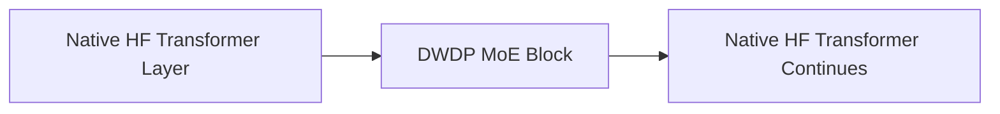
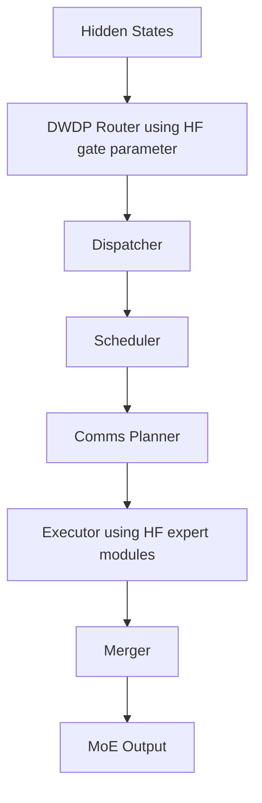

# DWDP Hugging Face Adapters

## Overview

The adapter layer rewrites supported Hugging Face MoE blocks so their expert path executes through DWDP while the rest of the Transformer remains native Hugging Face.

It preserves:

- tokenizer
- embeddings
- rotary embeddings
- RMSNorm
- attention
- KV cache
- generation
- sampling
- logits processors
- decoding
- checkpoint loading
- model parameters

Only the Mixture-of-Experts block is replaced.



## Architecture

`BaseModelAdapter` defines the adapter interface.

`HuggingFaceAdapter` loads or wraps a Hugging Face model and delegates to a model-specific adapter when the registry detects a supported architecture.

`Qwen15MoEAdapter` discovers Qwen1.5/Qwen2-style sparse MoE blocks, extracts gate and expert modules, constructs DWDP replacements, and patches the model in-place.

`extractor.py` contains model-structure discovery utilities.

`patcher.py` provides reversible module replacement.

`validator.py` contains numerical parity utilities.

`registry.py` maps Hugging Face model/config metadata to adapter classes.

## Qwen1.5 MoE Path

For each supported MoE block:



The adapter shares parameter storage with the original Hugging Face gate and expert modules. The adapter redirects execution rather than rebuilding weights.

## Reversible Patching

`ModulePatcher` stores every replacement:

- qualified module name
- parent module
- child name
- original module
- replacement module

`restore_model()` reverses replacements in LIFO order. This enables A/B benchmarking between native Hugging Face and DWDP execution.

## Public Usage

```python
from dwdp import DWDPRuntime

runtime = DWDPRuntime.from_pretrained("Qwen/Qwen1.5-MoE-A2.7B")
output = runtime.generate("Hello")
```

```python
from transformers import AutoModelForCausalLM
from dwdp import DWDPRuntime

model = AutoModelForCausalLM.from_pretrained("Qwen/Qwen1.5-MoE-A2.7B")
runtime = DWDPRuntime.wrap(model)
```

## Future Adapters

Future model support should be added by implementing a new adapter and registry entry:

- `MixtralAdapter`
- `DeepSeekAdapter`
- `Qwen2MoEAdapter`
- `DBRXAdapter`
- `JetMoEAdapter`
- `LlamaMoEAdapter`

The DWDP runtime core should not change.
