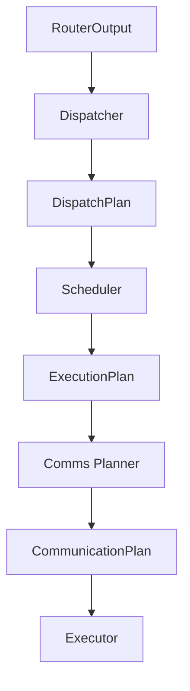

# Comms Planner

## Overview

The `DWDP.comms_planner` package builds a reusable communication blueprint from scheduler output.

Input:

```text
ExecutionPlan
```

Output:

```text
CommunicationPlan
```

The Comms Planner is a planning layer only. It does not execute communication, launch NCCL collectives, launch CUDA kernels, move tensors, prefetch weights, execute experts, allocate communication buffers, synchronize streams, or modify Scheduler output.

## Runtime Position



The Scheduler decides execution order. The Comms Planner describes communication requirements for that order.

## Single-GPU Behavior

The current runtime targets a single GPU. `StaticCommunicationPlanner` therefore emits:

- all scheduled experts as local experts
- no remote experts
- empty communication graph
- empty transfer descriptors
- empty communication groups
- empty dependency graph
- empty prefetch plan
- empty overlap plan
- zero communication cost
- local-only topology metadata

The public API is the same shape future distributed planners will use.

## Architecture

```text
DWDP/comms_planner/
  __init__.py
  base.py
  config.py
  cost_model.py
  graph.py
  metadata.py
  registry.py
  static.py
  topology.py
  utils.py
  workspace.py
  ops/
    __init__.py
    single_gpu.py
  kernels/
    __init__.py
    reference.py
```

### `config.py`

`CommunicationPlannerConfig` is immutable and controls:

- `planner_policy`
- `metadata_level`
- `deterministic`
- `enable_workspace`
- `enable_prefetch_metadata`
- `enable_overlap_metadata`
- `enable_topology_metadata`
- `enable_cost_model`
- `enable_statistics`
- `local_gpu_id`
- `world_size`
- `local_rank`
- parallelism placeholders
- stream and link placeholders

### `graph.py`

Defines the canonical communication graph:

- `CommunicationNode`
- `CommunicationEdge`
- `CommunicationGraph`

Future communication operations are nodes. Dependencies are edges.

### `metadata.py`

Defines the `CommunicationPlan` schema and descriptor types:

- `CommunicationDescriptor`
- `TransferDescriptor`
- `CommunicationGroup`
- `SynchronizationMetadata`
- `DependencyMetadata`
- `PrefetchPlan`
- `OverlapPlan`
- `CommunicationStatistics`
- `CommunicationPlan`

### `topology.py`

Defines hardware-independent topology metadata:

- GPU ids
- NUMA domains
- NVLink placeholders
- NVSwitch placeholders
- PCIe hierarchy placeholders
- communication domains
- locality groups
- fabric metadata

### `cost_model.py`

Defines placeholder cost model structures:

- estimated bytes
- latency
- bandwidth
- priority
- critical path
- transfer duration
- prefetch window
- overlap estimate

The current single-GPU plan has zero cost.

### `static.py`

`StaticCommunicationPlanner` is the default planner. It emits local-only communication metadata for single-GPU execution.

### `workspace.py`

`CommunicationPlannerWorkspace` owns reusable metadata buffers for empty graph tensors and topology tensors.

### `kernels/`

`reference_static_communication_plan()` is the replacement boundary for future device-side graph or metadata generation.

## Public API

### `CommunicationPlannerConfig`

Immutable planner configuration.

### `StaticCommunicationPlanner`

Default planner policy. Consumes `ExecutionPlan` and returns `CommunicationPlan`.

### `CommunicationPlan`

Executor-facing communication blueprint.

Contains:

- local and remote expert ids
- communication graph
- descriptors
- groups
- topology
- synchronization metadata
- dependency metadata
- prefetch plan
- overlap plan
- cost model
- statistics

### `CommunicationPlannerWorkspace`

Reusable metadata workspace for repeated planning.

## Future Planners

The registry supports future policies without changing Executor code:

- TopologyAwarePlanner
- CommunicationAwarePlanner
- BandwidthOptimizedPlanner
- LatencyOptimizedPlanner
- OverlapPlanner
- WeightResidencyPlanner
- CostModelPlanner
- LearnedCommunicationPlanner

Each policy should preserve the `CommunicationPlan` contract.

## Benchmark

`benchmarks/benchmark_comms_planner.py` measures:

- planner latency
- workspace reuse
- communication graph generation
- cost model generation
- statistics generation
- single-GPU overhead
- metadata bytes

No communication is executed.
