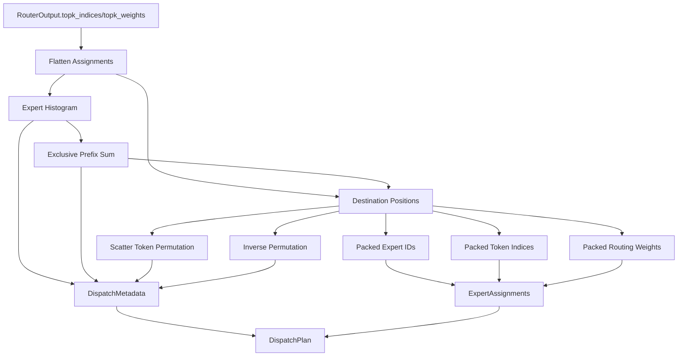

# Dispatcher

## Overview

The `DWDP.dispatcher` package converts logical routing assignments into an expert-major physical layout.

It begins after routing has already completed. The dispatcher consumes `RouterOutput`, groups assignments contiguously by expert, preserves routing weights, computes permutations and inverse permutations, and emits a reusable `DispatchPlan`.

The dispatcher does not perform:

- routing
- expert execution
- communication
- collective scheduling
- output merge
- model-specific execution policy

## Design Goals

- `inference-first`: the implementation assumes dispatch planning is on the latency path.
- `expert-major layout`: downstream expert execution should be able to consume contiguous expert-local slices directly.
- `deterministic ordering`: assignments are grouped by expert while preserving token-major order within each expert bucket.
- `O(N) default path`: the default algorithm is histogram + prefix-sum + scatter rather than global sort.
- `minimal allocation pressure`: optional `DispatchWorkspace` enables buffer reuse across iterations.
- `backend independence`: the public data structures do not encode CUDA, Triton, NCCL, or topology-specific behavior.
- `kernel replacement boundaries`: `kernels/reference.py` isolates the reference path so future Triton or CUDA kernels can replace it without changing the dispatcher API.
- `torch.compile friendliness`: the hot path is expressed with vectorized tensor primitives and no Python loops over tokens.

## Architecture

```text
DWDP/dispatcher/
  __init__.py
  assignments.py
  base.py
  config.py
  expert_major.py
  metadata.py
  plan.py
  registry.py
  utils.py
  workspace.py
  ops/
    __init__.py
    histogram.py
    packing.py
    permutation.py
    prefix_sum.py
  kernels/
    __init__.py
    reference.py
```

Related files:

```text
tests/dispatcher/test_expert_major_dispatcher.py
benchmarks/benchmark_dispatcher.py
docs/dispatcher.md
```

### `config.py`

`DispatcherConfig` defines:

- `num_experts`
- `dispatcher_type`
- `algorithm`
- `stable_order`
- `reuse_router_metadata`
- `validate_inputs`
- `index_dtype`

The current reference path requires `torch.int64` indices. Supported algorithms are:

- `counting_scatter`: histogram + prefix-sum + deterministic scatter
- `stable_sort`: preserved baseline based on stable sort

### `expert_major.py`

`ExpertMajorDispatcher` is the concrete dispatcher implementation.

It:

1. validates `RouterOutput`
2. flattens token-major `topk_indices` and `topk_weights`
3. optionally reuses router-provided counts and offsets
4. calls `reference_expert_major_dispatch()`
5. packages the result as `DispatchPlan`

### `assignments.py`

`ExpertAssignments` holds the expert-major packed tensors:

- `expert_ids`
- `packed_token_indices`
- `packed_routing_weights`

All are 1D tensors of length `num_assignments = T * K`.

### `metadata.py`

`DispatchMetadata` stores:

- logical sizes
- original token shape
- per-expert counts
- expert offsets
- expert-major permutation
- inverse permutation
- destination positions
- stable ordering policy

`destination_positions` is currently identical to `inverse_permutation`. It maps token-major assignment positions to expert-major slots.

### `plan.py`

`DispatchPlan` combines `ExpertAssignments` and `DispatchMetadata` into the single object returned by the dispatcher.

### `workspace.py`

`DispatchWorkspace` owns reusable buffers for:

- permutations
- packed expert ids
- packed token indices
- packed routing weights
- counts
- offsets

The workspace is optional. If provided, the dispatcher attempts to reuse existing capacity.

### `ops/`

The `ops` subpackage contains reusable tensor primitives:

- `compute_expert_histogram()`
- `exclusive_cumsum()`
- `compute_destination_positions()`
- `stable_expert_permutation()`
- `invert_permutation()`
- `pack_token_indices()`
- `pack_routing_weights()`
- `scatter_token_permutation()`
- `scatter_token_indices()`
- `scatter_routing_weights()`
- `scatter_expert_ids()`

These define the reference semantics independently of the higher-level dispatcher class.

### `kernels/`

`reference_expert_major_dispatch()` is the explicit fused-kernel replacement boundary.

Today it selects between two reference paths:

- `counting_scatter_expert_major_dispatch()`
- `stable_sort_expert_major_dispatch()`

Later these can be replaced by Triton or CUDA code that preserves the same return contract.

### `registry.py`

Provides name-based dispatcher construction:

- `register_dispatcher()`
- `get_dispatcher_class()`
- `build_dispatcher()`

`ExpertMajorDispatcher` is registered as `expert_major`.

## Forward Path



## Public API

### `DispatcherConfig`

Construction-time policy for dispatch planning.

### `ExpertMajorDispatcher`

Consumes `RouterOutput` and returns `DispatchPlan`.

### `DispatchPlan`

Top-level dispatch artifact returned by the dispatcher.

### `DispatchMetadata`

Permutation, count, offset, and shape metadata required by later runtime stages.

### `DispatchWorkspace`

Optional reusable buffer pool for repeated dispatch calls.

### `ExpertAssignments`

Expert-major packed assignment tensors that a future executor can consume directly.

## Tests

The current test suite validates:

- stable expert grouping
- output equivalence between counting-scatter and stable-sort
- top-k greater than one
- inverse permutation correctness
- workspace reuse
- router metadata reuse
- registry construction
- configuration validation
- expert-id range validation

## Benchmark

`benchmarks/benchmark_dispatcher.py` measures:

- end-to-end dispatcher latency for both algorithms
- latency with and without workspace reuse
- histogram cost
- prefix-sum cost
- destination-position cost for counting-scatter
- permutation cost for stable-sort
- inverse permutation cost
- packing cost

This benchmark is intended to remain stable when future Triton or CUDA implementations are added.
