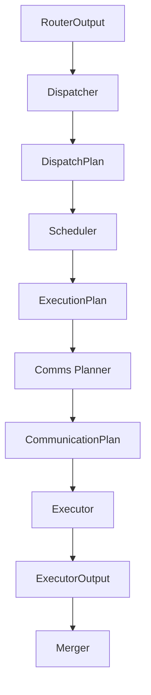

# Executor

## Overview

The `DWDP.executor` package is the first DWDP runtime layer that performs model computation.

Input:

- hidden states
- `DispatchPlan`
- `ExecutionPlan`
- `CommunicationPlan`

Output:

- `ExecutorOutput`

The Executor does not perform routing, dispatch planning, token reordering policy, scheduling, communication planning, communication execution, or output merging. Those responsibilities belong to earlier or later runtime stages.

## Runtime Position



## Architecture

```text
DWDP/executor/
  __init__.py
  base.py
  config.py
  experts.py
  metadata.py
  outputs.py
  pytorch.py
  registry.py
  utils.py
  workspace.py
  ops/
    __init__.py
    reference.py
  kernels/
    __init__.py
    reference.py
  backends/
    __init__.py
```

## PyTorch Backend

`PyTorchExecutor` is the reference backend. It:

1. flattens hidden states into token-major 2D form
2. validates finalized planning artifacts
3. iterates experts exactly in `ExecutionPlan.expert_queue` order
4. gathers hidden states using `DispatchPlan.assignments.packed_token_indices`
5. executes the registered expert module
6. applies routing weights
7. writes packed outputs and weighted outputs
8. returns `ExecutorOutput`

The backend supports arbitrary expert modules that follow the standard interface:

```text
expert(hidden_states: Tensor) -> Tensor
```

## Public API

### `ExecutorConfig`

Immutable execution configuration.

Fields include:

- `backend`
- `dtype`
- `enable_workspace`
- `enable_statistics`
- `enable_profiling`
- `deterministic`
- `max_tokens_per_expert`
- future distributed and async placeholders

### `ExpertRegistry`

Container mapping global expert ids to `torch.nn.Module` expert implementations.

### `PyTorchExecutor`

Reference local expert execution backend.

### `ExecutorOutput`

Packed executor result consumed by the future Merger.

Contains:

- `packed_expert_outputs`
- `weighted_expert_outputs`
- per-expert output descriptors
- output metadata
- execution metadata
- statistics
- timing placeholder
- workspace metadata

## Workspace

`ExecutorWorkspace` reuses buffers for:

- packed expert outputs
- weighted expert outputs
- gathered activations
- temporary outputs

This avoids repeated allocation during inference iterations and keeps the API compatible with future CUDA Graph constraints.

## Kernel Boundaries

Current replacement boundary:

```text
kernels/reference.py::reference_execute_expert
```

Future backends can replace PyTorch internals with:

- Triton kernels
- CUDA kernels
- grouped GEMM
- persistent kernels
- FP8 execution
- TensorRT execution
- multi-stream execution
- distributed expert execution

without changing Executor inputs or `ExecutorOutput`.

## Tests and Benchmark

Tests live in `tests/executor/test_pytorch_executor.py`.

Benchmark scaffold:

```text
benchmarks/benchmark_executor.py
```

The benchmark measures executor latency, tokens/sec, workspace reuse, expert execution, routing weight application, and output collection for the reference PyTorch backend.
