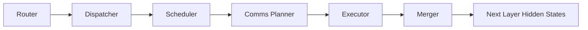
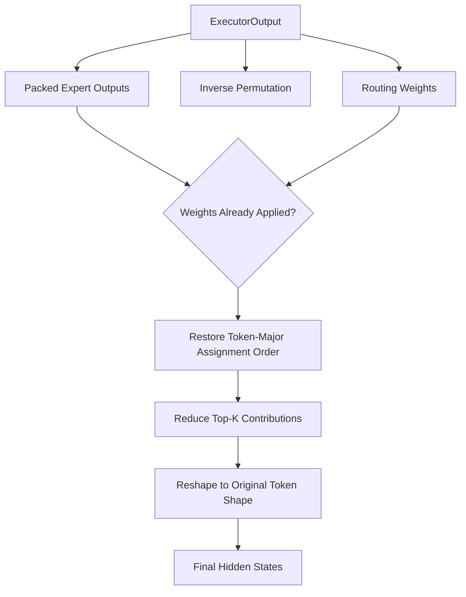

# DWDP Merger

## Overview

The Merger is the final reconstruction stage in the DWDP MoE runtime. It consumes `ExecutorOutput` and produces the hidden-state tensor consumed by the next Transformer layer.

The module is intentionally scoped to output reconstruction. It does not perform routing, dispatch, scheduling, communication planning, communication, expert execution, or output planning for earlier stages.

## Design Goals

- Keep reconstruction independent from Router, Dispatcher, Scheduler, and Comms Planner.
- Consume only `ExecutorOutput`, so previous runtime stages remain replaceable.
- Preserve the expert-major layout until the final reconstruction boundary.
- Support arbitrary Top-K routing through a generic assignment reduction.
- Reuse workspace buffers to avoid repeated allocation in inference loops.
- Keep the public API stable for future Triton, CUDA, grouped reduction, persistent, asynchronous, and distributed implementations.
- Isolate reference tensor operations under `ops/` and `kernels/` so optimized kernels can replace internals without changing callers.

## Architecture

`config.py` defines immutable `MergerConfig`. It selects the backend, enables workspace reuse, controls statistics/profiling placeholders, selects whether routing weights are applied in the Merger, and enables shape validation.

`base.py` defines `BaseMerger`, the backend interface. All merger implementations consume `ExecutorOutput` and return `MergerOutput`.

`pytorch.py` implements `PyTorchMerger`, the reference backend. It validates `ExecutorOutput`, selects weighted or unweighted expert outputs, restores token-major assignment order with `inverse_permutation`, reduces Top-K contributions, reshapes the flat tensor back to the original token shape, and emits typed metadata.

`outputs.py` defines `MergerOutput`, the strongly typed output object containing final hidden states plus merge metadata, statistics, timing placeholders, and workspace metadata.

`metadata.py` defines `MergeMetadata`, `MergeStatistics`, `TimingMetadata`, and `WorkspaceMetadata`.

`workspace.py` defines `MergerWorkspace`, which owns reusable token-major assignment and merged-output buffers.

`ops/` contains reusable reference tensor primitives for token reconstruction and Top-K reduction.

`kernels/` provides the current reference merge boundary. Future Triton or CUDA kernels should replace this layer first.

`registry.py` implements backend registration and construction.

`tests/` validates reconstruction correctness, Top-K accumulation, workspace reuse, registry behavior, and shape validation.

`benchmarks/` contains an independent benchmark driver for merge latency, Top-K scaling, throughput, and workspace reuse.

## Merge Pipeline

The reference implementation expects `ExecutorOutput.output_metadata` to carry all reconstruction metadata. The Merger never reads `RouterOutput`, `DispatchPlan`, `ExecutionPlan`, or `CommunicationPlan`.

## Public API

### `MergerConfig`

Configuration for merger backend construction.

- `backend`: registry backend name. Defaults to `pytorch`.
- `enable_workspace`: enables reusable buffers when a workspace is provided.
- `enable_statistics`: preserves statistics generation controls.
- `enable_profiling`: placeholder for future timing instrumentation.
- `deterministic`: records deterministic execution intent.
- `apply_routing_weights`: if true, the Merger multiplies `packed_expert_outputs` by `packed_routing_weights`; otherwise it uses `weighted_expert_outputs` produced by the Executor.
- `validate_shapes`: enables input shape validation.

### `PyTorchMerger`

Reference backend implemented with PyTorch tensor operations.

Input:

- `ExecutorOutput`
- optional `MergerWorkspace`

Output:

- `MergerOutput`

### `MergerOutput`

Contains:

- `hidden_states`: reconstructed token-major hidden states.
- `metadata`: token shape, assignment shape, inverse permutation, Top-K, and deterministic flag.
- `statistics`: token count, assignment count, Top-K, output width, backend, and whether Executor-weighted outputs were used.
- `timing`: profiling placeholders.
- `workspace`: workspace usage metadata.

## Performance Considerations

The reference backend performs two logical operations: permutation restoration and Top-K reduction. Workspace buffers remove repeated allocation for both the token-major assignment tensor and final flat output tensor. The final reshape is a view when the output layout is compatible.

Current PyTorch primitives are intentionally simple replacement boundaries. Production GPU backends can fuse inverse permutation, routing-weight application, and Top-K accumulation into a single Triton or CUDA kernel to reduce global memory traffic.

## Future Work

The backend abstraction supports future implementations without changing callers:

- `TritonMerger`
- `CUDAMerger`
- `GroupedReductionMerger`
- `PersistentMerger`
- `DistributedMerger`
- `MultiStreamMerger`

Future implementations can add segmented reductions, fused weighted accumulation, warp-level reductions, block-level reductions, persistent kernels, and distributed reductions while preserving the `BaseMerger` API.
