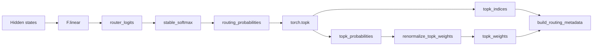

# Router

## Overview

The `DWDP.router` package implements expert selection for Mixture-of-Experts inference.

Within the DWDP runtime, the router is responsible for:

- computing router logits from hidden states
- converting logits into routing probabilities
- selecting top-k experts per token
- renormalizing selected routing weights
- generating routing metadata for downstream runtime components

The router does not perform:

- dispatch
- expert execution
- communication
- scheduling
- output merging

This separation is deliberate. The router owns only the decision step. All token movement and expert-side execution remain outside the package.

## Design Goals

The current implementation is organized around the constraints of inference runtimes rather than model examples.

- `modularity`: projection, probability computation, top-k selection, renormalization, and metadata construction are isolated into small units with explicit boundaries.
- `low latency`: the forward path is short and uses vectorized PyTorch operations (`F.linear`, `torch.softmax`, `torch.topk`, `torch.bincount`) with no per-token Python loops.
- `inference-first design`: the default path assumes router decisions are latency-sensitive and prepares metadata that later runtime stages can consume directly.
- `extensibility`: additional router families can be introduced through `BaseRouter` and `registry.py` without changing consumer code.
- `clean interfaces`: `RouterConfig`, `RouterOutput`, and `RoutingMetadata` define the public contract between the router and the rest of the runtime.
- `torch.compile compatibility`: the hot path is expressed as straight-line tensor code with limited Python branching.
- `Triton replacement boundaries`: `kernels/fused.py` provides a single entry point where a fused Triton or CUDA implementation can replace the current reference path.
- `minimal memory movement`: hidden states are flattened with `reshape`, routed in 2D form, and restored to token-major shape only for the returned outputs.

## Architecture

### Package Layout

```text
DWDP/router/
  __init__.py
  base.py
  config.py
  linear.py
  metadata.py
  registry.py
  types.py
  utils.py
  ops/
    __init__.py
    renorm.py
    softmax.py
    topk.py
  kernels/
    __init__.py
    fused.py
```

Related files outside the package:

```text
tests/router/test_linear_router.py
benchmarks/benchmark_router.py
```

### `__init__.py`

Exports the public package surface:

- `LinearTopKRouter`
- `MetadataLevel`
- `RouterConfig`
- `RouterOutput`
- `RoutingMetadata`
- `build_router`
- `get_router_class`
- `register_router`

This file defines the stable import surface for router consumers.

### `config.py`

`RouterConfig` centralizes construction-time router configuration in a frozen dataclass. It exists so router instantiation and runtime policy remain explicit, serializable, and independent of any particular router implementation.

`MetadataLevel` controls how much metadata is materialized:

- `NONE`: no metadata object is returned
- `COUNTS`: materialize per-expert counts and prefix offsets
- `FULL`: materialize counts, offsets, flattened token indices, flattened expert indices, and flattened weights

`RouterConfig` fields:

| Field | Type | Meaning |
| --- | --- | --- |
| `hidden_size` | `int` | Final dimension of the input hidden states. |
| `num_experts` | `int` | Global number of experts. |
| `top_k` | `int` | Number of experts selected per token. |
| `bias` | `bool` | Whether the linear router projection includes bias. |
| `router_type` | `str` | Registry key used by `build_router`. Defaults to `linear_topk`. |
| `softmax_dtype` | `torch.dtype \| None` | Accumulation dtype passed to softmax. If `None`, reduced-precision logits default to FP32 accumulation. |
| `probability_dtype` | `torch.dtype \| None` | Optional output dtype cast for full routing probabilities. |
| `topk_sorted` | `bool` | Whether `torch.topk` returns sorted selections. |
| `renormalize` | `bool` | Whether selected top-k probabilities are renormalized onto the simplex. |
| `metadata_level` | `MetadataLevel` | Default metadata materialization level. |
| `score_scale` | `float` | Multiplicative post-projection scaling factor applied to router logits. |
| `eps` | `float` | Lower bound used when renormalizing top-k probabilities. |

`__post_init__` validates the basic routing invariants:

- dimensions must be positive
- `top_k <= num_experts`
- `score_scale > 0`
- `eps > 0`

### `base.py`

`BaseRouter` is the abstract interface for router implementations. It stores `RouterConfig`, exposes `num_experts` and `top_k` convenience properties, and requires implementations to provide:

- `compute_router_logits(flat_hidden_states)`
- `forward(hidden_states, metadata_level=None)`

This is the extension point for future router families.

### `linear.py`

`LinearTopKRouter` implements the current production path:

1. validate input shape against `hidden_size`
2. flatten all token dimensions into `[num_tokens, hidden_size]`
3. compute router logits with `torch.nn.functional.linear`
4. optionally scale logits by `score_scale`
5. compute stable softmax probabilities
6. select top-k experts from the probability tensor
7. optionally renormalize the selected weights
8. materialize routing metadata
9. restore token-major output shapes

Parameters:

- `weight`: shape `[num_experts, hidden_size]`
- `bias`: optional shape `[num_experts]`

Initialization:

- `weight` uses Xavier uniform initialization
- `bias` is zero-initialized when enabled

Forward output is returned as `RouterOutput`.

### `metadata.py`

`RoutingMetadata` stores auxiliary routing tensors needed by later runtime stages:

- `num_tokens`
- `num_experts`
- `top_k`
- `tokens_per_expert`
- `expert_offsets`
- `flattened_token_indices`
- `flattened_expert_indices`
- `flattened_weights`

`build_routing_metadata()` consumes flattened top-k indices and weights.

Current behavior:

- `tokens_per_expert` is computed with `torch.bincount`
- `expert_offsets` is a prefix sum with a leading zero
- `flattened_token_indices` is generated with `torch.arange(...).repeat_interleave(top_k)`
- flattened tensors remain in token-major order

Metadata generation is separated from dispatch because selection and movement are different concerns. The router produces counts and flat selections; a future dispatcher may reorder, compact, or shard those assignments without requiring the router to know anything about transport or execution topology.

### `types.py`

`RouterOutput` is the structured return type from router `forward()`:

- `router_logits`
- `routing_probabilities`
- `topk_indices`
- `topk_weights`
- `metadata`

This keeps the return contract stable even as router implementations evolve.

### `utils.py`

Utility helpers used by the router core:

- `validate_hidden_states()`: checks rank and trailing hidden dimension
- `flatten_token_dims()`: converts token-major input to 2D routing form
- `restore_token_dims()`: restores original token dimensions after routing
- `default_softmax_dtype()`: defaults FP16 and BF16 softmax accumulation to FP32

These helpers keep shape management and dtype policy out of the hot routing logic.

### `ops/`

The `ops` subpackage holds reusable functional primitives:

- `softmax.py`: `stable_softmax()`
- `topk.py`: `select_topk()`
- `renorm.py`: `renormalize_topk_weights()`

These are split out for two reasons:

- they are reusable across router variants
- they define narrow replacement points for fused implementations

Current behavior:

- `stable_softmax()` optionally computes softmax in a higher-precision dtype and optionally casts the output
- `select_topk()` wraps `torch.topk`
- `renormalize_topk_weights()` returns all ones when `top_k == 1`, otherwise divides by the selected-weight sum clamped by `eps`

### `kernels/`

`kernels/fused.py` currently contains `reference_topk_routing()`, which is a reference implementation, not a custom kernel.

It exists as an explicit replacement boundary for future Triton or CUDA fusion:

- softmax
- top-k selection
- top-k renormalization

`linear.py` depends on this function rather than directly sequencing the ops. That keeps the router API stable when the reference implementation is replaced by a fused path.

### `registry.py`

`registry.py` provides name-based router registration and construction:

- `register_router(name, router_cls)`
- `get_router_class(name)`
- `build_router(config)`

`LinearTopKRouter` registers itself under `linear_topk`.

This allows future router implementations to be added without changing caller logic. Consumers can instantiate from `RouterConfig.router_type` rather than importing a concrete class directly.

## Forward Pass

The current execution pipeline is:

```mermaid
flowchart TD
    A[Hidden States<br/>[batch, seq, hidden] or token-major prefix] --> B[Flatten Token Dimensions]
    B --> C[Linear Projection]
    C --> D[Router Logits<br/>[num_tokens, num_experts]]
    D --> E[Stable Softmax]
    E --> F[Routing Probabilities]
    F --> G[Top-K Selection]
    G --> H[Selected Probabilities and Expert Indices]
    H --> I[Weight Renormalization]
    I --> J[Top-K Weights]
    H --> K[Routing Metadata Construction]
    J --> K
    K --> L[Restore Token Dimensions]
    L --> M[RouterOutput]
```

More explicitly:



## Public API

### `RouterConfig`

Responsibilities:

- define router dimensions and runtime behavior
- validate configuration invariants at construction time
- provide a router-type key for registry-based instantiation

Inputs:

- hidden size, expert count, top-k, dtype policy, renormalization policy, metadata policy

Outputs:

- immutable configuration object consumed by router implementations

### `LinearTopKRouter`

Responsibilities:

- own router parameters
- project hidden states into expert logits
- execute the reference top-k routing path
- return router outputs in token-major shape

Input:

- `hidden_states` with trailing dimension equal to `hidden_size`

Output:

- `RouterOutput`

The module is deliberately limited to selection. It does not perform any expert-side operations.

### `RoutingMetadata`

Responsibilities:

- describe flattened routing assignments for downstream runtime stages
- provide per-expert counts and prefix offsets
- optionally expose flat token/expert/weight vectors

Input source:

- constructed from flattened top-k indices and weights

Output role:

- consumed by future dispatcher or scheduling layers that need assignment statistics or flat routing lists

## Performance Considerations

- `contiguous tensors`: the router uses `reshape`-based flattening and restoration. Non-contiguous inputs may still induce view/copy behavior depending on upstream layout.
- `memory allocations`: the current path allocates dense routing probabilities, top-k outputs, and optional metadata tensors. Metadata can be reduced via `MetadataLevel.NONE` or `MetadataLevel.COUNTS`.
- `numerical stability`: softmax can accumulate in FP32 for FP16 and BF16 inputs, and top-k renormalization clamps the denominator by `eps`.
- `compile friendliness`: the routing path is straight-line tensor code with minimal data-dependent Python control flow.
- `future kernel fusion`: `reference_topk_routing()` is the intended fusion boundary for softmax, top-k, and renormalization.
- `future Triton integration`: `ops/` defines reusable semantics, while `kernels/` defines the location where a Triton implementation can preserve the existing public API.
- `GPU execution`: all current operators map naturally to CUDA-backed PyTorch kernels; no custom CUDA or Triton code is present yet.

## Tests

The current test suite in `tests/router/test_linear_router.py` verifies:

- output shapes
- top-k weight normalization
- `top_k == 1` behavior
- metadata count consistency
- metadata disable path
- router logit correctness against manual `F.linear`
- registry-based construction
- configuration validation

Testing philosophy:

- validate router semantics directly
- keep tests small and deterministic at the API-contract level
- avoid coupling router tests to dispatch or execution concerns

The tests are written to skip when PyTorch is unavailable in the environment.

## Benchmarks

`benchmarks/benchmark_router.py` measures end-to-end router forward latency over repeated iterations.

It reports:

- average latency in microseconds
- tokens per second

Parameters include:

- batch size
- sequence length
- hidden size
- expert count
- top-k
- dtype
- device
- warmup iterations
- measured iterations
- optional `torch.compile`

The benchmark measures the current reference implementation as a whole. It does not isolate individual operators or kernel-level timing.

## Future Work

The existing architecture supports adding additional router implementations through `BaseRouter` and `registry.py` without modifying existing router consumers.

Candidate implementations include:

- Attention Router
- MLP Router
- Hash Router
- Sinkhorn Router
- Expert Choice Router
- Noisy Top-K Router

The intended extension model is:

- keep `RouterConfig` as the construction contract
- add a new router subclass
- register it under a new `router_type`
- preserve the existing `RouterOutput` and metadata contract where applicable

This allows future routing strategies to coexist behind the same runtime-facing interface.
