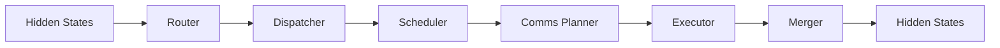

# DWDP Runtime Integration Layer

## Overview

The Runtime Integration Layer connects the existing DWDP stages into one end-to-end MoE inference backend:



The runtime is an orchestration layer only. It does not replace stage responsibilities, merge modules, introduce new runtime stages, or access module internals. Each stage communicates through its public typed input/output objects.

## Components

`runtime.py` defines `DWDPRuntime`, an `nn.Module` that owns the Router, Dispatcher, Scheduler, Comms Planner, Executor, and Merger.

`config.py` defines immutable `RuntimeConfig`.

`context.py` owns reusable per-stage workspaces.

`pipeline.py` defines `RuntimePipelineOutput`, which keeps every public stage output available for correctness and profiling.

`profiler.py` provides low-overhead wall-clock timing for the reference runtime.

`correctness.py` provides tensor comparison utilities used by parity tests.

`registry.py` provides runtime backend registration.

## Public API

```python
from dwdp import DWDPRuntime

runtime = DWDPRuntime.from_pretrained("/path/to/model")
output = runtime.generate("Hello")
```

```python
runtime = DWDPRuntime.build_reference(
    hidden_size=4096,
    num_experts=64,
    top_k=2,
    experts=experts,
)
hidden_states = runtime(hidden_states).hidden_states
```

`DWDPRuntime` exposes:

- `forward(hidden_states)`: execute one complete DWDP MoE pipeline.
- `generate(...)`: delegate generation through the active model adapter.
- `compile()`: compile stage modules when `RuntimeConfig.torch_compile=True`.
- `profile(hidden_states)`: run one profiled MoE pipeline invocation.
- `benchmark(hidden_states)`: measure reference runtime latency and throughput.

## Hugging Face Integration

`HuggingFaceAdapter` preserves the native Hugging Face model for all non-MoE behavior: attention, embeddings, LayerNorm, KV cache, tokenizer, and sampling remain outside DWDP.

The current reference adapter supports explicit MoE layer binding through `bind_moe_layer`. Model-specific automatic patching for Qwen, Mixtral, DeepSeek, and other architectures should be implemented as future adapters rather than hard-coded into the runtime.

## CLI

Supported entrypoints:

```bash
python -m dwdp run --model /path/to/model --backend dwdp --prompt "Hello"
python -m dwdp.run --model /path/to/model --backend dwdp --prompt "Hello"
python -m dwdp benchmark --model /path/to/model --backend hf --compare dwdp
```

## Profiling

The reference profiler records:

- Router
- Dispatcher
- Scheduler
- Comms Planner
- Executor
- Merger
- total runtime
- workspace bytes

CUDA event timing, `torch.profiler`, Nsight Systems, and Nsight Compute integration are future profiling layers.

## Correctness

The correctness harness compares native and DWDP tensors using max absolute error, mean absolute error, shape equality, and `torch.allclose`. Generated-token parity belongs in adapter-level tests once model-specific HF patching is added.

## Future Work

The runtime API is intended to survive future backend evolution:

```text
Reference PyTorch
    ↓
torch.compile
    ↓
Triton
    ↓
CUDA
    ↓
Grouped GEMM
    ↓
Persistent Kernels
    ↓
Distributed Execution
```

The orchestration layer should remain unchanged as individual stage internals are replaced.
