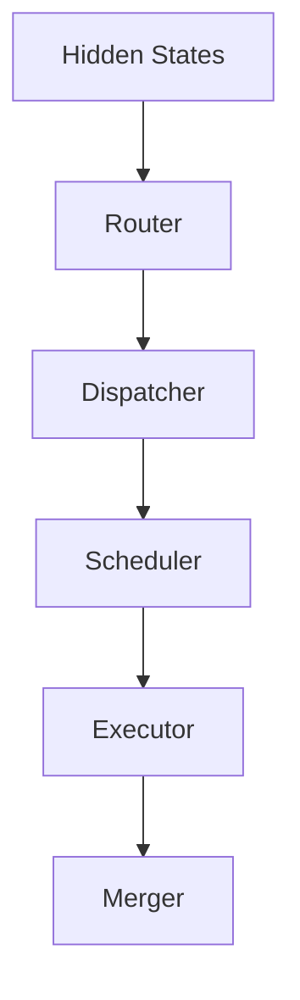
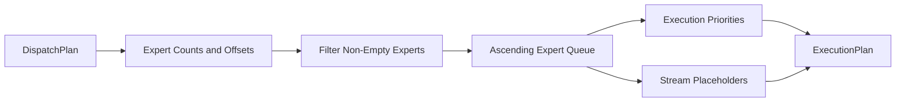

# Scheduler

## Overview

The `DWDP.scheduler` package builds executor-facing execution plans from dispatcher output.

The scheduler consumes only `DispatchPlan` and produces `ExecutionPlan`. It does not inspect router internals, move tensors, launch communication, execute experts, or access model weights.

Responsibilities:

- determine execution order
- build expert work queues
- create execution batches
- assign execution priorities
- assign stream placeholders
- expose dependency metadata placeholders
- expose synchronization metadata placeholders
- produce scheduler statistics

## Runtime Position



The dispatcher owns layout. The scheduler owns ordering. The executor consumes only `ExecutionPlan`.

## Architecture

```text
DWDP/scheduler/
  __init__.py
  base.py
  config.py
  execution.py
  metadata.py
  registry.py
  utils.py
  workspace.py
  ops/
    __init__.py
    round_robin.py
  kernels/
    __init__.py
    reference.py
  policies/
    __init__.py
    round_robin.py
```

### `config.py`

`SchedulerConfig` is immutable and defines scheduling policy:

- `scheduling_policy`
- `deterministic`
- `enable_workspace`
- `metadata_level`
- `stream_count`
- `enable_dependency_metadata`
- `enable_barrier_metadata`
- `enable_prefetch_metadata`
- `enable_communication_metadata`
- `max_execution_batch_size`

`SchedulerMetadataLevel` controls Python execution-batch descriptor materialization:

- `MINIMAL`
- `FULL`

### `execution.py`

Defines executor-facing outputs:

- `ExecutionBatch`
- `ExecutionPlan`

`ExecutionPlan` contains contiguous tensor metadata plus optional Python descriptors.

### `metadata.py`

Defines scheduling metadata:

- `SynchronizationMetadata`
- `DependencyMetadata`
- `SchedulerStatistics`

The synchronization and dependency structures are placeholders for future stream, event, barrier, prefetch, and communication-aware policies.

### `workspace.py`

`SchedulerWorkspace` owns reusable buffers for per-iteration scheduler outputs.

It avoids repeated allocations for:

- execution order
- expert queue
- expert starts
- expert ends
- active expert counts
- execution priorities
- stream assignments
- barrier flags
- dependency edge buffers

### `policies/round_robin.py`

`RoundRobinScheduler` is the default policy.

It schedules non-empty experts in ascending expert id order and skips empty experts. It preserves expert-major dispatch ranges by directly reading `DispatchMetadata.expert_offsets`.

### `ops/`

Contains tensor-level scheduling primitives. `build_round_robin_schedule()` produces the core tensor metadata for the Round Robin policy.

### `kernels/`

`reference_round_robin_schedule()` is the replacement boundary for future device-side scheduling metadata generation.

## Round Robin Policy

Given expert counts:

```text
counts = [0, 3, 0, 2, 1]
```

Round Robin produces:

```text
expert_queue = [1, 3, 4]
execution_order = [0, 1, 2]
```

The executor can use:

```text
start = expert_starts[i]
end = expert_ends[i]
```

to consume the expert-major slice produced by the dispatcher.



## Public API

### `SchedulerConfig`

Immutable scheduler configuration.

### `RoundRobinScheduler`

Default scheduler policy.

Input:

- `DispatchPlan`
- optional `SchedulerWorkspace`

Output:

- `ExecutionPlan`

### `ExecutionPlan`

The only scheduler artifact the future executor should consume.

Contains:

- `execution_order`
- `expert_queue`
- `expert_starts`
- `expert_ends`
- `expert_counts`
- `execution_priority`
- `stream_assignments`
- `batches`
- `synchronization`
- `dependencies`
- `statistics`

### `SchedulerWorkspace`

Reusable buffer pool for scheduler metadata.

## Future Policies

The scheduler registry supports adding policies without changing executor code:

- Largest First
- Smallest First
- Load Balanced
- Greedy
- Communication Aware
- Locality Aware
- Cache Aware
- Weight Residency Aware
- Cost Model Based
- Learned Scheduling

New policies should implement `BaseScheduler`, register under a policy name, and return the same `ExecutionPlan` contract.

## Benchmark

`benchmarks/benchmark_scheduler.py` measures:

- scheduler latency
- scheduler latency with and without workspace reuse
- metadata generation cost
- active-expert scheduling throughput
- output metadata bytes
- workspace bytes

No expert execution is measured.
