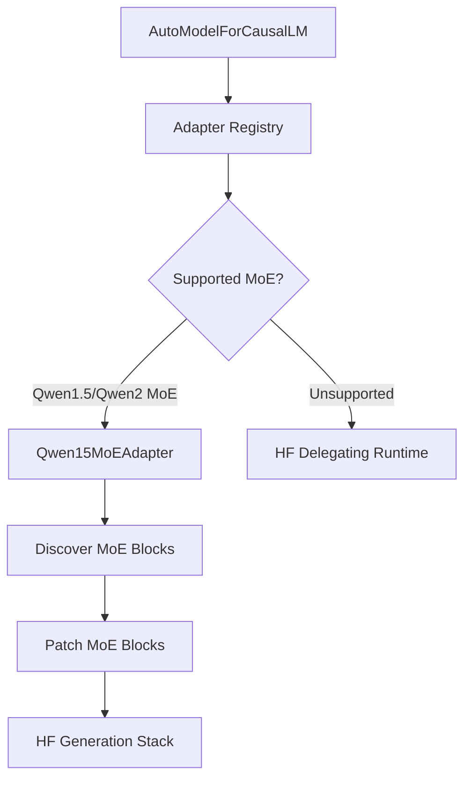
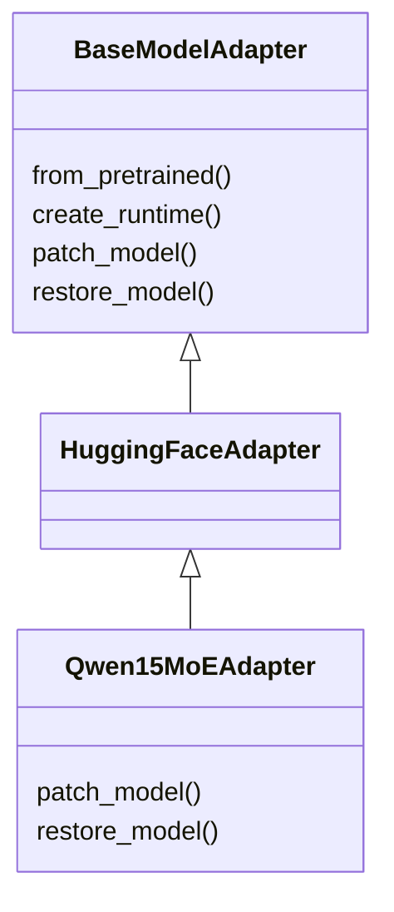
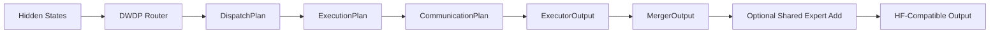

# Automatic Hugging Face MoE Integration

## Scope

The automatic Hugging Face integration layer makes DWDP a drop-in MoE execution backend for supported Hugging Face models.

The integration behaves like a compiler pass over the loaded model:

1. Inspect model/config metadata.
2. Select an adapter from the registry.
3. Discover supported MoE blocks.
4. Extract router/gate and expert modules.
5. Build DWDP MoE replacements.
6. Patch only the MoE blocks.
7. Leave the remaining Transformer graph unchanged.



## Invariants

Adapters must not replace:

- tokenizer
- embeddings
- rotary embeddings
- RMSNorm
- attention
- KV cache
- generation
- sampling
- logits processors
- decoding
- checkpoint loading
- non-MoE weights

The adapter only redirects MoE block execution through:

```text
Router -> Dispatcher -> Scheduler -> Comms Planner -> Executor -> Merger
```

## Adapter Hierarchy



`HuggingFaceAdapter` is the generic entrypoint. It loads or wraps a model, then asks the registry whether a model-specific adapter supports it.

`Qwen15MoEAdapter` is the current automatic adapter. It targets Qwen1.5/Qwen2-style sparse MoE layers that expose:

- `gate`
- `experts`
- `top_k` or config-level `num_experts_per_tok`
- optional `shared_expert`
- optional `shared_expert_gate`

## Discovery

`discover_qwen_moe_layers(model)` scans `model.named_modules()` and records modules with a linear gate and expert container.

For each layer it extracts:

- qualified name
- parent module
- child name
- gate projection
- expert modules
- hidden size
- number of experts
- Top-K
- shared-expert availability

No layer index is hardcoded.

## Parameter Sharing

The DWDP replacement shares Hugging Face parameter storage:

- `DWDPMoEBlock.router.weight` references the original gate weight.
- `DWDPMoEBlock.router.bias` references the original gate bias when present.
- `PyTorchExecutor` receives the original expert modules through `ExpertRegistry`.
- shared expert modules are reused directly.

This avoids checkpoint rewriting and unnecessary parameter copies.

## Patched MoE Block

`DWDPMoEBlock` is the replacement for a native HF sparse MoE block.



The wrapper preserves the Qwen MoE return convention by returning:

```python
(hidden_states, router_logits)
```

for Qwen-style blocks.

## Reversibility

`ModulePatcher` records:

- module name
- parent module
- child attribute
- original module
- replacement module

`restore_model()` restores the native Hugging Face modules. This enables direct A/B comparisons.

## Correctness Harness

`validator.py` provides:

- maximum absolute error
- mean absolute error
- maximum relative error
- `torch.allclose`
- generated-token parity

The harness is intended for:

- layer-by-layer hidden-state parity
- MoE output parity
- router output parity
- generated-token parity

## Benchmarking

`benchmarks/runtime/benchmark_hf_adapter.py` is a reference benchmark scaffold for comparing native Hugging Face and DWDP-patched generation.

It is designed to measure:

- latency
- tokens/sec
- first-token latency
- memory
- module timings

The benchmark is not executed as part of implementation.

## Future Adapter Implementation

To add a new model family:

1. Implement discovery for the model's MoE block structure.
2. Extract gate/router parameters and expert modules.
3. Build a DWDP replacement module that preserves the native forward signature.
4. Register the adapter with `register_model_adapter`.
5. Add parity tests and documentation.

The DWDP runtime core should remain unchanged.
