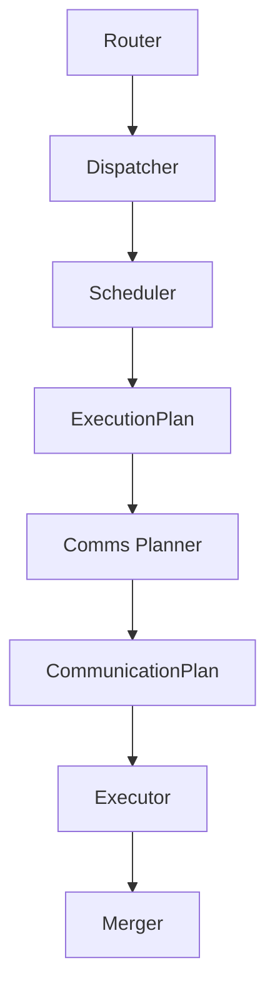
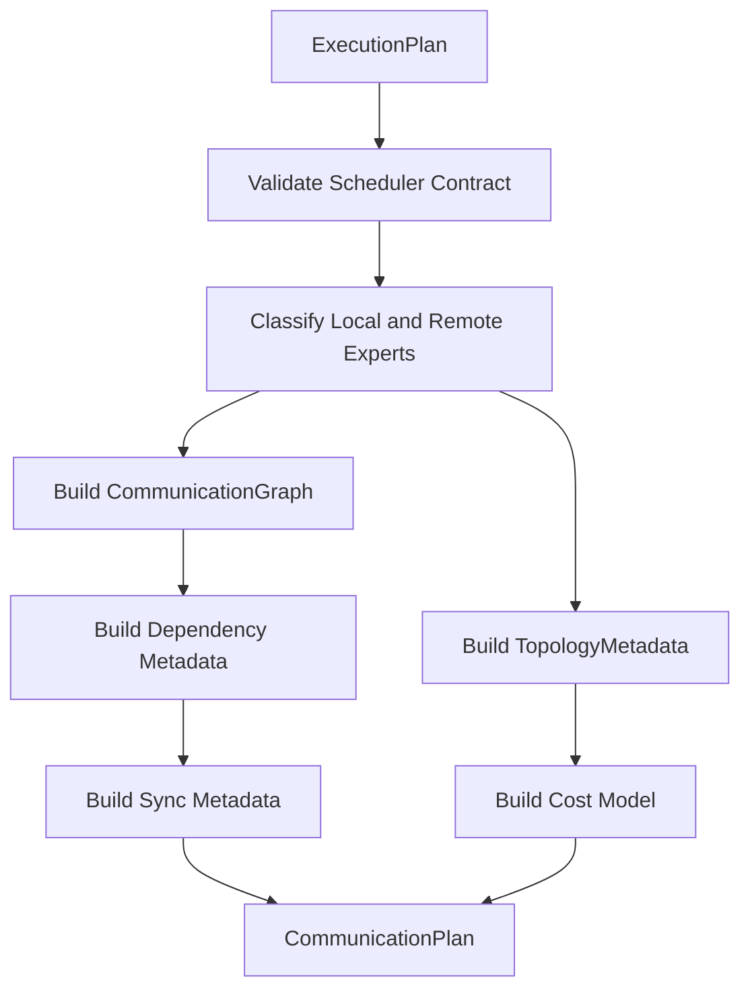

# Comms Planner Engineering Notes

## Scope

The Comms Planner is the permanent abstraction layer between scheduling and execution.

It consumes:

```text
ExecutionPlan
```

and produces:

```text
CommunicationPlan
```

It never executes communication. It only describes communication that would be required by future distributed execution.

The planner does not:

- launch NCCL
- launch CUDA kernels
- move tensors
- allocate communication buffers
- synchronize CUDA streams
- prefetch weights
- execute experts
- inspect Router or Dispatcher output
- modify Scheduler output

## Runtime Boundary



The Scheduler decides expert execution order. The Comms Planner describes communication requirements for that order. The Executor should consume `CommunicationPlan` and `ExecutionPlan` without needing to know which planner policy produced them.

## Current Implementation

The current implementation provides:

```text
StaticCommunicationPlanner
```

This policy targets the current single-GPU runtime. All scheduled experts are considered local. Remote communication is empty and total estimated cost is zero.

The implementation still emits the full `CommunicationPlan` schema so future distributed planners can replace internals without changing downstream APIs.

## CommunicationPlan

`CommunicationPlan` is strongly typed and contains:

- `local_expert_ids`
- `remote_expert_ids`
- `CommunicationGraph`
- `CommunicationDescriptor`
- `TransferDescriptor`
- `CommunicationGroup`
- `TopologyMetadata`
- `SynchronizationMetadata`
- `DependencyMetadata`
- `PrefetchPlan`
- `OverlapPlan`
- `CommunicationCostModel`
- `CommunicationStatistics`

This avoids loosely coupled tensor tuples and provides a stable executor-facing contract.

## Communication Graph

The graph is the canonical representation of future distributed communication.


Planned communication operations are represented as nodes. Dependencies are represented as edges.

In single-GPU mode:

```text
nodes = ()
edges = ()
node_ids = empty
edge_src = empty
edge_dst = empty
```

This is semantically meaningful: no remote communication is required.

## Planning Algorithm

The static planner executes:

1. validate `ExecutionPlan`
2. classify scheduled experts as local
3. emit empty remote expert set
4. build empty communication graph
5. build empty dependency metadata
6. build empty synchronization metadata
7. build empty prefetch metadata
8. build empty overlap metadata
9. emit local-only topology metadata
10. emit zero communication cost
11. build `CommunicationPlan`



## Interaction With Scheduler

The Comms Planner consumes the scheduler contract:

- `expert_queue`
- `expert_starts`
- `expert_ends`
- `expert_counts`
- `execution_priority`
- `stream_assignments`
- scheduler dependency placeholders
- scheduler synchronization placeholders

The current static planner primarily uses `expert_queue` to classify local experts. Future distributed planners may use priorities, streams, ranges, and dependencies to build communication order and overlap plans.

## Interaction With Executor

The Executor should not infer communication requirements from `ExecutionPlan` directly.

`CommunicationPlan` gives the Executor:

- communication graph
- transfer descriptors
- communication groups
- stream placeholders
- event placeholders
- dependency graph
- topology metadata
- cost estimates
- prefetch opportunities
- overlap opportunities

This lets communication planning evolve independently from execution.

## Topology Abstraction

`TopologyMetadata` is hardware independent.

It can represent:

- GPU ids
- NUMA domains
- NVLink connectivity
- NVSwitch domains
- PCIe hierarchy
- communication domains
- locality groups
- fabric metadata
- link bandwidth
- link latency

The current static planner emits local GPU topology only.

Future planners can populate these fields for:

- Expert Parallelism
- Tensor Parallelism
- Pipeline Parallelism
- Sequence Parallelism
- NVLink
- NVSwitch
- PCIe
- InfiniBand
- RDMA
- DeepEP

## Cost Model

`CommunicationCostModel` contains aggregate estimates:

- total estimated bytes
- total estimated latency
- critical path
- estimated bandwidth

`CommunicationCostEstimate` is the per-descriptor structure for future distributed transfers:

- estimated bytes
- estimated latency
- estimated bandwidth
- communication priority
- critical path estimate
- transfer duration
- prefetch window
- overlap estimate

The current single-GPU plan returns zero estimates because there are no remote transfers.

## Prefetch and Overlap Metadata

`PrefetchPlan` exposes:

- prefetch expert ids
- prefetch priorities
- prefetch windows

`OverlapPlan` exposes:

- communication node ids
- compute batch ids
- overlap windows

The static planner leaves these empty. Future weight-residency and overlap-aware planners can populate them without changing `CommunicationPlan`.

## Policy Architecture

Communication planners are selected by:

```text
CommunicationPlannerConfig.planner_policy
```

The default is:

```text
static
```

Future planner policies:

- TopologyAwarePlanner
- CommunicationAwarePlanner
- BandwidthOptimizedPlanner
- LatencyOptimizedPlanner
- OverlapPlanner
- WeightResidencyPlanner
- CostModelPlanner
- LearnedCommunicationPlanner

Each planner should implement `BaseCommunicationPlanner`, register under a policy name, and return the same `CommunicationPlan`.

## Workspace Reuse

`CommunicationPlannerWorkspace` provides reusable metadata buffers for:

- empty graph tensors
- empty dependency tensors
- topology GPU ids
- topology NUMA domains

The current single-GPU planner has minimal allocation pressure, but the workspace contract is in place for future distributed metadata generation.

## Kernel Replacement Boundaries

Current boundary:

```text
kernels/reference.py::reference_static_communication_plan
```

Future Triton or CUDA implementations may generate:

- local/remote expert classification
- communication graph node tensors
- dependency edge tensors
- communication group metadata
- transfer descriptors
- topology-derived locality metadata

without changing public APIs.

## Benchmark

`benchmarks/benchmark_comms_planner.py` measures:

- planner latency with workspace reuse
- planner latency without workspace reuse
- graph generation latency
- cost model generation latency
- statistics generation latency
- single-GPU overhead
- metadata bytes
- workspace bytes

No communication or expert execution is performed.

## Tests

`tests/comms_planner/test_static_communication_planner.py` validates:

- single-GPU correctness
- empty communication graph
- empty transfer descriptors
- dependency graph correctness
- topology metadata correctness
- cost model correctness
- statistics correctness
- prefetch and overlap emptiness
- workspace reuse
- disabled workspace behavior
- registry construction
- configuration validation
- invalid `ExecutionPlan` rejection
