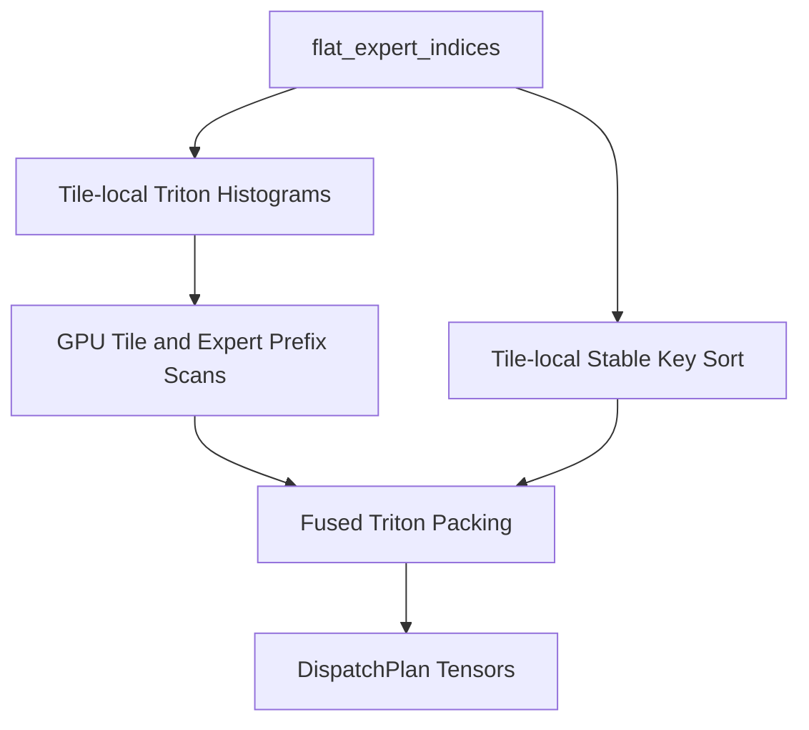

# Dispatcher Engineering Notes

## Scope

The dispatcher transforms completed routing assignments into an execution-ready memory layout.

Input:

- `RouterOutput.topk_indices`
- `RouterOutput.topk_weights`
- optional router metadata

Output:

- `DispatchPlan`

The dispatcher does not perform routing or expert execution. It is a layout transform and metadata generation stage.

## Current Data Model

The current package exposes five public structures:

- `DispatcherConfig`
- `ExpertAssignments`
- `DispatchMetadata`
- `DispatchPlan`
- `DispatchWorkspace`

### `ExpertAssignments`

`ExpertAssignments` stores the expert-major packed assignment stream:

- `expert_ids`
- `packed_token_indices`
- `packed_routing_weights`

Each tensor is 1D with length:

```text
num_assignments = T * K
```

where:

- `T` is the number of routed tokens
- `K` is top-k

### `DispatchMetadata`

`DispatchMetadata` stores the structural information needed by later runtime stages:

- `num_tokens`
- `num_assignments`
- `num_experts`
- `top_k`
- `token_shape`
- `expert_counts`
- `expert_offsets`
- `token_permutation`
- `inverse_permutation`
- `destination_positions`
- `stable_order`

`destination_positions` is currently identical to `inverse_permutation`. It maps token-major assignment positions into expert-major slots.

### `DispatchPlan`

`DispatchPlan` is the top-level return object. It carries:

- packed assignment tensors
- dispatch metadata

This is the boundary intended for future executor and communication layers.

### `DispatchWorkspace`

`DispatchWorkspace` is an optional reusable buffer pool. It currently owns 1D buffers for:

- `token_permutation`
- `inverse_permutation`
- `packed_expert_ids`
- `packed_token_indices`
- `packed_routing_weights`
- `expert_counts`
- `expert_offsets`

The workspace is backend independent. It does not encode stream ownership, launch policy, communication state, or topology-specific buffers.

## Mathematical Formulation

Let:

- `T` = number of routed tokens
- `E` = number of experts
- `K` = top-k experts per token
- `N = T * K` = total number of assignments

The dispatcher consumes:

```text
topk_indices  ∈ Z^(T x K)
topk_weights  ∈ R^(T x K)
```

The current implementation flattens these tensors in row-major token-major order:

```text
flat_expert_indices  ∈ Z^N
flat_routing_weights ∈ R^N
```

If the flattened assignment position is `a`, the corresponding token id is:

```text
token_id(a) = floor(a / K)
```

This property is used directly in the reference implementation. The dispatcher does not materialize a separate flattened token-major token-index tensor before permutation.

The goal is to construct an expert-major ordering:

```text
perm ∈ Z^N
```

such that:

```text
packed_expert_ids[i] = flat_expert_indices[perm[i]]
packed_routing_weights[i] = flat_routing_weights[perm[i]]
packed_token_indices[i] = floor(perm[i] / K)
```

and `packed_expert_ids` is nondecreasing.

The implementation also constructs the inverse permutation:

```text
inv_perm[perm[i]] = i
```

This gives the destination slot for each token-major assignment.

## Why Expert-Major Layout

Later MoE runtime stages typically want to execute or move assignments in expert-major order.

An expert-major layout enables:

- contiguous per-expert slices
- direct indexing through prefix offsets
- simpler payload packing for future communication layers
- lower scheduling overhead in the executor
- better locality for expert-local kernels

The dispatcher is therefore responsible for turning token-major routing output into a representation where each expert’s assignments occupy a contiguous segment.

## Deterministic Ordering

The current implementation preserves token-major order within each expert bucket.

The default implementation achieves this with an O(N) counting-scatter plan:

```text
destination_positions[a] = expert_offsets[expert_a] + local_rank_within_expert(a)
```

where `local_rank_within_expert(a)` counts prior assignments to the same expert in token-major order.

The repository also preserves the older stable-sort implementation as a benchmark and correctness baseline.

If two assignments target the same expert, their relative order in the expert-major layout remains the same as their original token-major order.

This property matters because:

- it removes ambiguity from packed layouts
- it simplifies debugging and validation
- it makes later executor behavior easier to reason about
- it gives a predictable baseline for future fused implementations

## Algorithm

The default expert-major dispatch path follows these stages:

1. flatten routing assignments
2. compute per-expert histogram
3. compute exclusive prefix offsets
4. compute destination positions
5. scatter expert-major permutation
6. build inverse permutation
7. derive packed token indices
8. pack routing weights
9. return `DispatchPlan`

### 1. Flatten Routing Assignments

The dispatcher flattens:

```text
topk_indices  -> flat_expert_indices
topk_weights  -> flat_routing_weights
```

with:

```text
flat_expert_indices = topk_indices.reshape(-1)
flat_routing_weights = topk_weights.reshape(-1)
```

The original token shape is retained in `DispatchMetadata.token_shape`.

### 2. Expert Histogram

The dispatcher computes:

```text
expert_counts[e] = | { a : flat_expert_indices[a] = e } |
```

with `torch.bincount`.

If router metadata contains compatible `tokens_per_expert`, the dispatcher can reuse that tensor directly instead of recomputing the histogram.

### 3. Exclusive Prefix Sum

The dispatcher computes:

```text
expert_offsets[0] = 0
expert_offsets[e + 1] = expert_offsets[e] + expert_counts[e]
```

This defines contiguous slices for each expert in the packed assignment stream.

If router metadata already provides compatible expert offsets, the dispatcher can reuse that tensor directly.

### 4. Destination Positions

The dispatcher first computes:

```text
destination_positions[a]
```

for every assignment `a`. This is the expert-major slot that the assignment will occupy after packing.

In the current reference implementation, destination positions are computed with a host-side O(N) counting pass over:

- `flat_expert_indices`
- `expert_offsets`

That pass is deterministic and avoids global sort, but it is still only a reference keyed-scan implementation. A future Triton or CUDA kernel should replace it with a device-resident scan.

### 5. Scatter Expert-Major Layout

Once `destination_positions` is available, the packed layout is formed with scatter operations:

```text
token_permutation[destination_positions[a]] = a
packed_expert_ids[destination_positions[a]] = flat_expert_indices[a]
packed_token_indices[destination_positions[a]] = floor(a / K)
packed_routing_weights[destination_positions[a]] = flat_routing_weights[a]
```

This is the core counting-scatter packing step.

### 6. Inverse Permutation

The inverse permutation is identical to the token-major destination map:

```text
inverse_permutation[a] = destination_positions[a]
```

The current implementation exposes the same tensor as both:

- `inverse_permutation`
- `destination_positions`

### 7. Packed Token Indices

Packed token indices are derived directly from the flattened assignment position:

```text
packed_token_indices[destination_positions[a]] = floor(a / K)
```

This still avoids materializing a separate token-major token-index tensor.

### 8. Packed Routing Weights

Weights are scattered into expert-major order using the same destination map.

### 9. Return Structured Output

The final output is:

```text
DispatchPlan(
    assignments=ExpertAssignments(...),
    metadata=DispatchMetadata(...),
)
```

## Reference Implementation Layout

```text
DWDP/dispatcher/
  assignments.py
  base.py
  config.py
  expert_major.py
  metadata.py
  plan.py
  registry.py
  utils.py
  workspace.py
  ops/
  kernels/
```

### `expert_major.py`

`ExpertMajorDispatcher` is the main implementation class.

Its `forward()` method:

- validates `RouterOutput`
- flattens assignments
- optionally reuses router counts and offsets
- calls `reference_expert_major_dispatch()`
- wraps the results into `DispatchPlan`

### `ops/`

The `ops` package contains the individual reference primitives:

- `histogram.py`: `compute_expert_histogram()`
- `prefix_sum.py`: `exclusive_cumsum()`
- `permutation.py`: `stable_expert_permutation()`, `invert_permutation()`
- `packing.py`: `pack_token_indices()`, `pack_routing_weights()`

These files define the current tensor-level semantics independently of the dispatcher class.

### `kernels/reference.py`

`reference_expert_major_dispatch()` is the explicit replacement boundary for future fused implementations.

It currently selects between two reference algorithms:

- `counting_scatter_expert_major_dispatch()`
- `stable_sort_expert_major_dispatch()`
- `triton_counting_scatter_expert_major_dispatch()`

The default is `counting_scatter`.

The counting-scatter path orchestrates:

- histogram
- prefix sum
- destination-position computation
- scatter packing

The stable-sort path is preserved as a baseline and comparison point. The Triton path is selected with `DispatcherConfig(algorithm="triton_counting_scatter")` and must produce tensors identical to the counting-scatter reference.

This function is the most direct insertion point for future Triton or CUDA kernels.

### `kernels/triton.py`

`kernels/triton.py` contains the GPU-optimized deterministic dispatcher backend. It uses no global sort and no global expert-counter atomics.

The backend partitions token-major assignments into fixed-size tiles. A Triton histogram kernel writes one private `[E]` histogram row per tile. GPU scans convert those rows into (1) the normal global expert offsets and (2) each tile's exclusive reservation in each expert bucket. The fused packing kernel sorts only the bounded tile-local key `(expert_id, source_lane)`, then directly writes the final packed tensors.

The source-lane suffix makes every local key unique. Consequently, assignments for the same expert are ordered by source position within each tile, while tile reservations are ordered by tile id. The resulting global order exactly matches the counting-scatter reference.

Temporary metadata is `[ceil(N / tile_size), E]` rather than assignment-sized. `DispatchWorkspace` owns and reuses these buffers. Device `torch.cumsum` is retained as a deliberate scan replacement boundary for a future fully Triton/CUDA hierarchical scan.

The Triton path preserves the same output tuple as the reference path:

```text
expert_counts
expert_offsets
token_permutation
inverse_permutation
packed_expert_ids
packed_token_indices
packed_routing_weights
```

No public dispatcher, scheduler, executor, or runtime API changes are required.

### `workspace.py`

`DispatchWorkspace` implements reusable buffer provisioning. The current implementation resizes lazily and returns slices of sufficiently large backing tensors.

Workspace reuse applies to:

- sort outputs
- inverse permutation
- packed token indices
- packed routing weights
- counts
- offsets
- Triton tile histogram and prefix scratch

## Why Router Metadata Reuse Exists

The router can already provide:

- `tokens_per_expert`
- `expert_offsets`

When those tensors are present and compatible, recomputing them in the dispatcher is unnecessary.

The current dispatcher therefore exposes `reuse_router_metadata` in `DispatcherConfig` and reuses router counts and offsets when:

- metadata is present
- tensor sizes match `num_experts`
- tensors use `torch.int64`

This is a pure optimization. The dispatcher remains correct when router metadata is absent.

## Why Kernels Are Isolated

The package separates:

- public API and metadata structures
- tensor-level reference operations
- fused-kernel boundary

This matters because the long-term performance path is unlikely to remain a sequence of generic PyTorch ops.

A future fused implementation may combine:

- histogram construction
- prefix sum
- destination computation
- permutation generation
- packed weight movement

The current package isolates the boundary so those changes do not leak into the dispatcher’s consumer-facing API.

## Expected Interaction With a Future Executor

The current output is shaped for a later executor or communication layer to consume directly.

Expected usage:

1. read `expert_counts` and `expert_offsets`
2. use contiguous expert-major slices from `ExpertAssignments`
3. gather token payloads using `packed_token_indices`
4. preserve weight alignment through `packed_routing_weights`
5. reconstruct token-major assignment order with `inverse_permutation` if needed

The dispatcher intentionally does not:

- map global expert ids to local experts
- partition work across expert-parallel ranks
- decide communication order
- overlap communication with execution
- launch expert kernels

Those belong to future runtime layers.

## Performance Considerations

### Memory Movement

The current implementation avoids:

- a global sort in the default path
- a pre-permutation flattened token-index tensor

Packed token indices are derived directly from flattened assignment positions.

The remaining unavoidable packed outputs are:

- expert ids
- packed token indices
- packed routing weights
- permutation vectors

### Workspace Reuse

When dispatch shapes repeat across iterations, `DispatchWorkspace` avoids reallocating the core output buffers. This is particularly relevant for iterative decoding where dispatch shapes are often stable or change slowly.

### Counting-Scatter Tradeoffs

The counting-scatter algorithm has the right asymptotic structure for production dispatch:

- O(N) histogram
- O(E) prefix sum
- O(N) destination generation
- O(N) scatter packing

Relative to stable sort, it removes the global `O(N log N)` grouping step and the associated sort traffic.

The PyTorch reference implementation still has one important limitation: keyed destination generation is performed on the host because generic PyTorch does not expose a device-resident keyed prefix-scan primitive with the semantics this dispatcher needs. That means:

- algorithmically, the path is counting-scatter
- architecturally, it is ready for Triton/CUDA
- practically, the current reference implementation is not yet the final GPU-optimized kernel

The preserved `stable_sort` path remains a useful baseline because it stays fully device-resident in stock PyTorch.

### Triton Counting-Scatter

The Triton backend keeps the counting-scatter semantics GPU resident.



The histogram kernel uses atomic adds only inside a tile-private histogram row. Expert-bucket ordering does not depend on atomics. Each tile receives an exclusive reservation in every expert bucket:

```text
destination(a) = expert_offsets[expert[a]]
               + tile_prefix[tile(a), expert[a]]
               + local_rank_in_tile(a)
```

`tile_prefix` is an exclusive scan over tiles in source order. `local_rank_in_tile` comes from a bounded local sort of the unique key `(expert_id, source_lane)`. The source-lane suffix means that every expert's assignments retain source order within a tile; source-ordered tile reservations then give exactly the reference counting-scatter result globally.

This replaces the prior all-input stable-rank implementation, which repeatedly scanned the complete assignment vector. There is no global sort and no O(N²) rank calculation. The local sort has fixed tile-size cost, while global memory traffic remains linear in assignments plus compact `[ceil(N / tile_size), E]` metadata.

The tradeoff is deliberate. The scratch matrix grows with both the number of input tiles and experts, so very small batches with very large expert counts can be dominated by scan and metadata cost. For the intended inference regime of thousands of assignments and 8--128 experts, it removes the pathological rank pass, limits histogram contention to a tile, and avoids global sorting workspace. The benchmark matrix is the decision point for future per-architecture tile-size specialization; output semantics remain unchanged regardless of that tuning.

### Compile Friendliness

The reference path uses straight-line tensor operations and does not iterate over assignments in Python. This is intentionally compatible with future `torch.compile` deployment.

### GPU Execution

The reference implementation relies on PyTorch kernels for:

- reshape
- bincount
- cumsum
- sort
- scatter
- index_select

The Triton backend implements tile histograms, tile-local starts, and fused packing with custom kernels. Device-side `torch.cumsum` produces expert and tile prefix scans; it is the remaining explicit replacement boundary for a specialized Triton/CUDA hierarchical scan.

## Future Kernel Strategy

The intended evolution path is:

1. keep the public `DispatchPlan` contract stable
2. replace device-side prefix scans with a specialized hierarchical Triton or CUDA scan when profiling justifies it
3. preserve workspace semantics where practical
4. optionally specialize for local-expert or grouped-expert layouts later

Potential future fusion targets include:

- histogram + prefix sum
- direct keyed destination-position computation
- fused expert grouping + packed weight movement
- local-expert remapping for expert-parallel execution

The tiled histogram and fused pack are implemented now. A fully fused hierarchical scan, more hardware-specific tile-size tuning, and CUDA persistent implementations remain future work.

## Tests and Benchmark

### Tests

`tests/dispatcher/test_expert_major_dispatcher.py` validates:

- stable expert grouping
- equivalence between counting-scatter and stable-sort plans
- top-k greater than one
- inverse permutation correctness
- workspace reuse
- router metadata reuse
- registry-based construction
- configuration validation
- expert range validation

`tests/dispatcher/test_triton_dispatcher.py` is CUDA/Triton-gated and compares the Triton backend against the counting-scatter reference for:

- random routing
- multiple expert counts
- multiple Top-K values
- deterministic edge cases
- workspace reuse
- permutation and metadata equality

### Benchmark

`benchmarks/benchmark_dispatcher.py` measures:

- end-to-end latency for `counting_scatter`
- end-to-end latency for `stable_sort`
- latency with and without workspace reuse
- histogram cost
- prefix-sum cost
- destination-position cost
- stable-sort permutation cost
- inverse permutation cost
- packing cost
- assignment throughput
- packed output bytes
- workspace buffer size

The benchmark is designed so future Triton or CUDA implementations can be compared against the current reference path at the same API boundary.

`benchmarks/benchmark_dispatcher_triton.py` compares the reference counting-scatter backend against `triton_counting_scatter` over configurable token, expert, and Top-K matrices. It checks parity before timing and reports latency, assignments/sec, peak allocated memory, workspace bytes, and CUDA profiler kernel-event counts.
