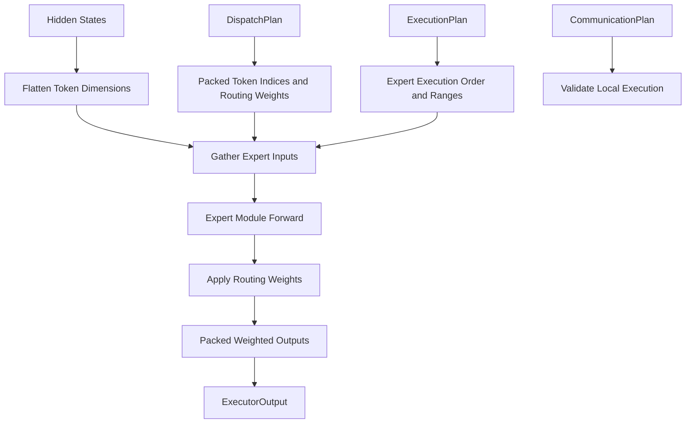

# Executor Engineering Notes

## Scope

The Executor is the DWDP computation layer. It is the first runtime component that invokes expert modules.

It consumes:

```text
hidden_states
DispatchPlan
ExecutionPlan
CommunicationPlan
```

and produces:

```text
ExecutorOutput
```

It does not:

- route tokens
- select experts
- build dispatch layout
- reorder execution
- generate schedules
- generate communication plans
- launch communication
- merge outputs
- mutate prior plan objects

## Execution Pipeline



The Executor preserves expert-major layout. It writes outputs in the same packed assignment order produced by the Dispatcher and scheduled by the Scheduler.

## Data Contracts

### Inputs

`DispatchPlan` provides:

- packed token indices
- packed expert ids
- packed routing weights
- token permutation metadata
- inverse permutation metadata
- token shape
- top-k

`ExecutionPlan` provides:

- expert queue
- execution order
- expert start/end ranges
- expert counts
- execution priority
- stream placeholders

`CommunicationPlan` provides:

- local expert ids
- remote expert ids
- communication policy metadata

The reference `PyTorchExecutor` supports local experts only and rejects non-empty `remote_expert_ids`.

### Output

`ExecutorOutput` contains:

- `packed_expert_outputs`
- `weighted_expert_outputs`
- `ExpertOutput` records
- `OutputMetadata`
- `ExecutionMetadata`
- `ExecutionStatistics`
- `TimingMetadata`
- `WorkspaceMetadata`

The future Merger should consume `ExecutorOutput` directly. It should not inspect `DispatchPlan` or `ExecutionPlan`.

## Expert Abstraction

Experts are arbitrary `torch.nn.Module` instances registered in `ExpertRegistry`.

Expected interface:

```text
expert(hidden_states: Tensor) -> Tensor
```

The Executor does not assume a specific MLP architecture. The reference tests use simple scale experts; benchmark scaffolding uses a small MLP.

## PyTorch Reference Backend

`PyTorchExecutor` executes experts sequentially in scheduler order:

1. read `ExecutionPlan.expert_queue`
2. for each expert, read `[start, end)` from `ExecutionPlan`
3. gather hidden states using packed token indices
4. call the expert module
5. multiply outputs by routing weights
6. write unweighted and weighted outputs into packed buffers
7. emit metadata for Merger

The Executor never chooses a different order. Reordering belongs to Scheduler.

## Routing Weights

Routing weights are applied after expert computation:

```text
weighted_output = expert_output * routing_weight
```

This supports arbitrary top-k because each packed assignment carries its own routing weight. Aggregation is intentionally left to Merger.

## Workspace

`ExecutorWorkspace` owns reusable buffers:

- `packed_expert_outputs`
- `weighted_expert_outputs`
- `gathered_activations`
- `temporary_outputs`

Workspace reuse reduces allocation churn in repeated inference iterations. The design also keeps room for future CUDA Graph-compatible allocation discipline.

## Backend Architecture

The backend registry is keyed by:

```text
ExecutorConfig.backend
```

Current backend:

```text
pytorch
```

Future backends:

- TritonExecutor
- CUDAExecutor
- GroupedGEMMExecutor
- PersistentKernelExecutor
- FP8Executor
- DistributedExecutor
- AsynchronousExecutor
- MultiStreamExecutor
- TensorRTExecutor

Backends should preserve the same public input and output contracts.

## Kernel Replacement Boundaries

The reference backend uses standard PyTorch operations:

- `index_select` for gather
- `nn.Module` forward for expert execution
- pointwise multiply for routing weights
- copy into packed output buffers

Replacement boundary:

```text
DWDP/executor/kernels/reference.py::reference_execute_expert
```

Future optimized implementations can fuse or replace:

- gather + GEMM
- grouped GEMM across experts
- routing-weight application
- output writeback
- FP8 quantization/dequantization
- persistent expert kernels
- Hopper TMA movement
- Blackwell Tensor Core paths

## Storage-Preserving Grouped Expert ABI

`ExpertWeightProvider` is an executor-internal abstraction for optimized MoE
weight access. `QwenSwiGLUWeightProvider` extracts `gate_proj`, `up_proj`, and
`down_proj` from Qwen-style experts and defines the canonical logical layouts:

```text
gate_up_weights: [E, 2I, H]
down_weights:    [E, H, I]
```

The logical gate/up tensor is represented by paired per-expert matrix views,
not an eagerly concatenated `torch.Tensor`. Native Hugging Face experts own
independent parameter storage, and concatenating all projections would
duplicate model weights. Provider construction retains references to those
original tensors, exposes dtype/device/format metadata for FP16, BF16, FP8,
and INT4 backends, and makes materialization explicit.

`TritonExpertExecutor` is the registered `triton` backend boundary. In this
milestone it validates Qwen SwiGLU expert layout and delegates to the PyTorch
reference executor. Future grouped Triton/CUDA kernels can consume the same
provider without changing `ExecutorConfig`, plans, or `ExecutorOutput`.

## Grouped Matrix Multiplication Prototype

`executor/kernels/grouped_matmul.py` implements the first Triton execution
kernel independently from full SwiGLU execution. It consumes expert-major
activations `[N, K]`, packed physical weights `[E, O, K]`, and
`DispatchPlan.metadata.expert_offsets`. Triton programs are indexed by expert,
token tile, and output tile, so all expert ranges execute in one kernel launch
without Python expert iteration. The output is written directly to `[N, O]` in
dispatcher order.

The provider's default matrix views preserve separate Hugging Face parameter
storage. A dense `[E, O, K]` tensor is therefore made only through explicit
prototype materialization. This copy is excluded from grouped-GEMM benchmark
timing and is not invoked from `TritonExpertExecutor.forward()`. A future
packed-weight loader or pointer-array CUDA backend can replace that boundary
without changing the grouped-matmul call contract.

without changing Executor API.

## Distributed Execution

The current backend rejects remote experts. Distributed execution will require a backend that consumes populated `CommunicationPlan` descriptors.

The existing metadata already preserves:

- remote expert ids
- communication policy
- stream placeholders
- scheduling policy
- packed expert-major ranges

Future distributed backends can add communication overlap, prefetch, and remote execution while preserving `ExecutorOutput`.

## Tests

`tests/executor/test_pytorch_executor.py` validates:

- expert execution correctness
- routing weight application
- execution order preservation
- workspace reuse
- disabled workspace behavior
- registry construction
- config validation
- remote expert rejection
- missing expert rejection

## Benchmark

`benchmarks/benchmark_executor.py` measures:

- executor latency
- tokens/sec
- expert throughput proxy
- workspace reuse
- output buffer size
- packed and weighted output generation

The benchmark does not perform routing, dispatching, scheduling, communication planning, or merging.
