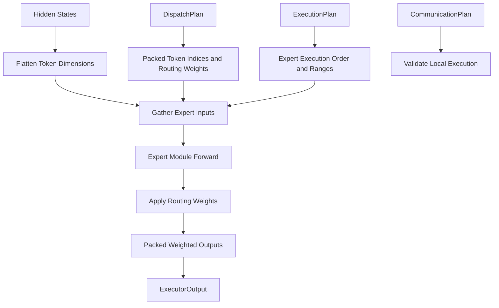

# Executor Engineering Notes

## Scope

The Executor is the DWDP computation layer. It is the first runtime component that invokes expert modules.

It consumes:

```text
hidden_states
DispatchPlan
ExecutionPlan
CommunicationPlan
```

and produces:

```text
ExecutorOutput
```

It does not:

- route tokens
- select experts
- build dispatch layout
- reorder execution
- generate schedules
- generate communication plans
- launch communication
- merge outputs
- mutate prior plan objects

## Execution Pipeline


```mermaid
flowchart TD
    A[Hidden States] --> B[Flatten Token Dimensions]
    C[DispatchPlan] --> D[Packed Token Indices and Routing Weights]
    E[ExecutionPlan] --> F[Expert Execution Order and Ranges]
    G[CommunicationPlan] --> H[Validate Local Execution]
    B --> I[Gather Expert Inputs]
    D --> I
    F --> I
    I --> J[Expert Module Forward]
    J --> K[Apply Routing Weights]
    K --> L[Packed Weighted Outputs]
    L --> M[ExecutorOutput]
```

The Executor preserves expert-major layout. It writes outputs in the same packed assignment order produced by the Dispatcher and scheduled by the Scheduler.

## Data Contracts

### Inputs

`DispatchPlan` provides:

- packed token indices
- packed expert ids
- packed routing weights
- token permutation metadata
- inverse permutation metadata
- token shape
- top-k

`ExecutionPlan` provides:

- expert queue
- execution order
- expert start/end ranges
- expert counts
- execution priority
- stream placeholders

`CommunicationPlan` provides:

- local expert ids
- remote expert ids
- communication policy metadata

The reference `PyTorchExecutor` supports local experts only and rejects non-empty `remote_expert_ids`.

### Output

`ExecutorOutput` contains:

- `packed_expert_outputs`
- `weighted_expert_outputs`
- `ExpertOutput` records
- `OutputMetadata`
- `ExecutionMetadata`
- `ExecutionStatistics`
- `TimingMetadata`
- `WorkspaceMetadata`

The future Merger should consume `ExecutorOutput` directly. It should not inspect `DispatchPlan` or `ExecutionPlan`.

## Expert Abstraction

Experts are arbitrary `torch.nn.Module` instances registered in `ExpertRegistry`.

Expected interface:

```text
expert(hidden_states: Tensor) -> Tensor
```

The Executor does not assume a specific MLP architecture. The reference tests use simple scale experts; benchmark scaffolding uses a small MLP.

## PyTorch Reference Backend

`PyTorchExecutor` executes experts sequentially in scheduler order:

1. read `ExecutionPlan.expert_queue`
2. for each expert, read `[start, end)` from `ExecutionPlan`
3. gather hidden states using packed token indices
4. call the expert module
5. multiply outputs by routing weights
6. write unweighted and weighted outputs into packed buffers
7. emit metadata for Merger

The Executor never chooses a different order. Reordering belongs to Scheduler.

## Routing Weights

Routing weights are applied after expert computation:

```text
weighted_output = expert_output * routing_weight
```

This supports arbitrary top-k because each packed assignment carries its own routing weight. Aggregation is intentionally left to Merger.

## Workspace

`ExecutorWorkspace` owns reusable buffers:

- `packed_expert_outputs`
- `weighted_expert_outputs`
- `gathered_activations`
- `temporary_outputs`

Workspace reuse reduces allocation churn in repeated inference iterations. The design also keeps room for future CUDA Graph-compatible allocation discipline.

## Backend Architecture

The backend registry is keyed by:

```text
ExecutorConfig.backend
```

Current backend:

```text
pytorch
```

Future backends:

- TritonExecutor
- CUDAExecutor
- GroupedGEMMExecutor
- PersistentKernelExecutor
- FP8Executor
- DistributedExecutor
- AsynchronousExecutor
- MultiStreamExecutor
- TensorRTExecutor

Backends should preserve the same public input and output contracts.

## Kernel Replacement Boundaries

The reference backend uses standard PyTorch operations:

- `index_select` for gather
- `nn.Module` forward for expert execution
- pointwise multiply for routing weights
- copy into packed output buffers

Replacement boundary:

```text
DWDP/executor/kernels/reference.py::reference_execute_expert
```

Future optimized implementations can fuse or replace:

- gather + GEMM
- grouped GEMM across experts
- routing-weight application
- output writeback
- FP8 quantization/dequantization
- persistent expert kernels
- Hopper TMA movement
- Blackwell Tensor Core paths

## Storage-Preserving Grouped Expert ABI

`ExpertWeightProvider` is an executor-internal abstraction for optimized MoE
weight access. `QwenSwiGLUWeightProvider` extracts `gate_proj`, `up_proj`, and
`down_proj` from Qwen-style experts and defines the canonical logical layouts:

```text
gate_up_weights: [E, 2I, H]
down_weights:    [E, H, I]
```

The logical gate/up tensor is represented by paired per-expert matrix views,
not an eagerly concatenated `torch.Tensor`. Native Hugging Face experts own
independent parameter storage, and concatenating all projections would
duplicate model weights. Provider construction retains references to those
original tensors, exposes dtype/device/format metadata for FP16, BF16, FP8,
and INT4 backends, and makes materialization explicit.

`TritonExpertExecutor` is the registered `triton` backend boundary. On CUDA it
builds a single non-owning `TensorList` from finalized plans and reusable
executor workspace buffers. TensorList uses contiguous Structure-of-Arrays
metadata (pointers, ids, ranges, dimensions, leading dimensions, dtype and
workspace fields), which grouped kernels load field-wise without per-expert
Python descriptors. It owns no activation, output, or weight storage; the
workspace owns metadata/intermediate allocations and the source modules retain
weight ownership. The grouped kernels omit zero-work experts, fuse gather with
gate/up and SwiGLU, then fuse down projection with routing multiplication and
output writes. CPU or Triton-less execution deliberately uses the reference
fallback without changing `ExecutorConfig`, plans, or `ExecutorOutput`.

## DWDP Persistent Pointer-Array Kernel

`executor/kernels/persistent.py` is a DWDP-specific persistent Triton engine,
not a dense grouped-GEMM adapter. Host construction converts TensorList into
reusable device-resident tile queues without sorting or packing weights. One
program per SM repeatedly atomically claims a tile, reads independent Qwen
gate/up/down addresses from TensorList, and claims another tile until empty.
This is GPU-side work stealing: no expert is statically assigned to a program.
SwiGLU and dependent down-projection queues are launched on the same stream,
so stream order provides stage dependency without host synchronization.

## Native FP8 Execution

The persistent executor prefers native FP8 on capable CUDA hardware. It
selects E4M3 when the current PyTorch/Triton installation exposes it, otherwise
chooses the next supported FP8 dtype. `backend="triton_fp8"` makes FP8 support
mandatory; `backend="triton"` retains the normal persistent path only where
native FP8 is unavailable. Expert parameters are converted in place once so
TensorList retains the same model tensor identities. Activations are quantized
once per forward into reusable FP8 workspace, and dedicated FP8 kernels use
FP32 accumulation while retaining FP8 inputs, intermediates, and outputs.

without changing Executor API.

## Distributed Execution

The current backend rejects remote experts. Distributed execution will require a backend that consumes populated `CommunicationPlan` descriptors.

The existing metadata already preserves:

- remote expert ids
- communication policy
- stream placeholders
- scheduling policy
- packed expert-major ranges

Future distributed backends can add communication overlap, prefetch, and remote execution while preserving `ExecutorOutput`.

## Tests

`tests/executor/test_pytorch_executor.py` validates:

- expert execution correctness
- routing weight application
- execution order preservation
- workspace reuse
- disabled workspace behavior
- registry construction
- config validation
- remote expert rejection
- missing expert rejection

## Benchmark

`benchmarks/benchmark_executor.py` measures:

- executor latency
- tokens/sec
- expert throughput proxy
- workspace reuse
- output buffer size
- packed and weighted output generation

The benchmark does not perform routing, dispatching, scheduling, communication planning, or merging.
