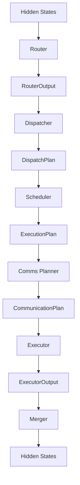
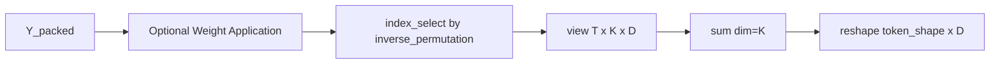
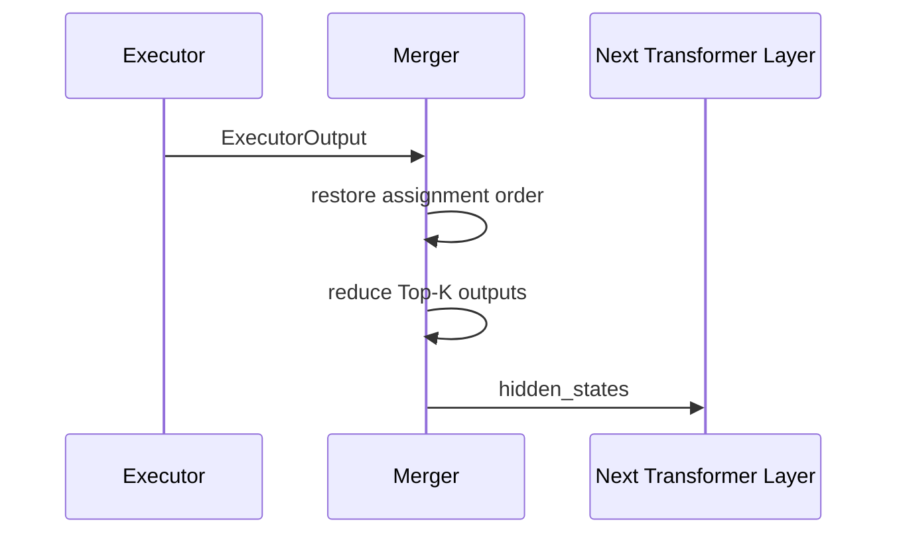

# DWDP Merger

## Purpose

The Merger is the terminal reconstruction stage of the DWDP runtime. It consumes only `ExecutorOutput` and produces the final hidden-state tensor for the next Transformer layer.

All upstream planning and execution decisions have already been made before this stage. The Merger therefore does not perform expert selection, dispatch, scheduling, communication planning, communication, or expert execution. Its responsibility is limited to reconstructing token-major hidden states from packed expert outputs.



This separation keeps the final reconstruction layer independent from the Router, Dispatcher, Scheduler, and Comms Planner. `ExecutorOutput` is the only contract the Merger understands.

## Mathematical Formulation

Let:

- `T` be the number of routed tokens.
- `K` be the number of selected experts per token.
- `D` be the expert output dimension.
- `N = T * K` be the number of packed expert assignments.

The Executor emits expert-major packed outputs:

```text
Y_packed in R^(N x D)
```

and routing weights:

```text
W_packed in R^N
```

The output metadata includes an inverse permutation that maps expert-major packed assignment positions back into token-major assignment positions. After restoration, the logical assignment tensor has shape:

```text
Y_token_major in R^(T x K x D)
```

The final merged output is:

```text
H_out[i] = sum_j Y_token_major[i, j]
```

When `MergerConfig.apply_routing_weights=True`, the Merger first applies:

```text
Y_packed[n] = Y_packed[n] * W_packed[n]
```

When `apply_routing_weights=False`, the Merger consumes `ExecutorOutput.weighted_expert_outputs`, which means the Executor has already applied routing weights.

## Algorithm

The current `PyTorchMerger` implements the reference algorithm:

1. Validate `ExecutorOutput` shapes when enabled.
2. Select the source tensor:
   - `weighted_expert_outputs` when Executor has applied routing weights.
   - `packed_expert_outputs * packed_routing_weights` when the Merger is configured to apply them.
3. Restore token-major assignment order using `inverse_permutation`.
4. Reshape assignments to `[T, K, D]`.
5. Sum across `K`.
6. Reshape the flat `[T, D]` output to `[*token_shape, D]`.
7. Return `MergerOutput`.



The reference implementation prioritizes a stable contract and clear replacement boundaries. It is not intended to be the final optimized GPU reduction.

## Why Reconstruction Is Isolated

Earlier runtime stages produce increasingly physical representations:

- Router selects experts.
- Dispatcher builds expert-major token layout.
- Scheduler orders expert execution.
- Comms Planner describes distributed communication.
- Executor computes packed expert outputs.

The Merger reverses only the final packing required for the next dense layer interface. Keeping this stage isolated prevents downstream tensor reconstruction from depending on routing policy, dispatch algorithm, scheduling policy, communication topology, or expert implementation.

Executor and Merger communicate through `ExecutorOutput`. This makes it possible to replace dispatch algorithms, scheduling policies, or communication planners without changing merge logic.

## Public Interfaces

### `BaseMerger`

`BaseMerger` is the abstract backend interface:

```python
forward(executor_output: ExecutorOutput, workspace: MergerWorkspace | None = None) -> MergerOutput
```

Backends must not mutate `ExecutorOutput` or inspect earlier runtime plans.

### `PyTorchMerger`

`PyTorchMerger` is the current reference backend. It uses PyTorch tensor operations for permutation restoration and Top-K accumulation.

### `MergerConfig`

`MergerConfig` is immutable and contains:

- `backend`
- `enable_workspace`
- `enable_statistics`
- `enable_profiling`
- `deterministic`
- `apply_routing_weights`
- `validate_shapes`
- distributed and asynchronous placeholder flags

The config is intentionally stable so future backends can add internal behavior without changing construction sites.

### `MergerWorkspace`

`MergerWorkspace` owns reusable buffers:

- `token_major_assignments`
- `merged_flat`

Buffers are resized only when shape, dtype, or device requirements exceed the current allocation. This supports inference loops where token and hidden dimensions are stable across iterations.

### `MergerOutput`

`MergerOutput` contains:

- `hidden_states`
- `MergeMetadata`
- `MergeStatistics`
- `TimingMetadata`
- `WorkspaceMetadata`
- backend name
- deterministic flag

The next Transformer layer consumes `hidden_states`. Profilers and future runtime components can consume the metadata without inspecting upstream plans.

## Files

- `DWDP/merger/config.py`: immutable backend configuration.
- `DWDP/merger/base.py`: abstract merger interface.
- `DWDP/merger/pytorch.py`: reference PyTorch backend.
- `DWDP/merger/outputs.py`: typed output object.
- `DWDP/merger/metadata.py`: merge statistics and metadata structures.
- `DWDP/merger/workspace.py`: reusable tensor workspace.
- `DWDP/merger/utils.py`: validation and tensor-size utilities.
- `DWDP/merger/ops/reference.py`: reference permutation and reduction primitives.
- `DWDP/merger/kernels/reference.py`: kernel replacement boundary for the full merge operation.
- `DWDP/merger/registry.py`: backend registration and construction.
- `tests/merger/`: unit tests independent from Executor internals beyond the `ExecutorOutput` contract.
- `benchmarks/benchmark_merger.py`: benchmark driver for latency, throughput, allocation behavior, and Top-K scaling.

## Performance Model

The reference merge path has two dominant memory operations:

1. Restoring token-major assignment order from expert-major packed outputs.
2. Reducing `K` assignments per token into one output vector.

For `N = T * K` assignments and hidden size `D`, the reference path reads `O(ND)` expert-output elements and writes an intermediate `O(ND)` token-major assignment buffer, then reads that buffer and writes `O(TD)` final output.

This is a clean baseline, but not the final high-performance design. A production Triton/CUDA backend should fuse some or all of:

- inverse permutation
- routing-weight multiplication
- Top-K accumulation
- final output write

The desired optimized path writes only the final `[T, D]` tensor and avoids materializing the full token-major assignment buffer when possible.

## Kernel Replacement Boundaries

The current replacement boundaries are:

- `ops/reference.py`: primitive operations.
- `kernels/reference.py`: full merge routine.
- `PyTorchMerger.forward`: backend-level orchestration.

Future implementations can replace `reference_merge` with:

- fused Triton reduction kernels
- CUDA scatter/reduction kernels
- segmented reductions
- warp-level reductions for small `K`
- block-level reductions for larger `D`
- persistent kernels for repeated decode shapes
- distributed reduction backends

The public `BaseMerger` API and `MergerOutput` contract should remain unchanged.

## Interaction With Executor

The Executor is responsible for expert computation and output packing. It emits:

- `packed_expert_outputs`
- `weighted_expert_outputs`
- `packed_routing_weights`
- `inverse_permutation`
- original `token_shape`
- `top_k`

The Merger trusts this contract and reconstructs from it. It does not recover state from `DispatchPlan`, `ExecutionPlan`, or `CommunicationPlan`.



## Distributed Future

The current implementation is local and single-process. The metadata layout leaves room for future implementations that merge:

- remote expert outputs
- tensor-parallel shards
- sequence-parallel shards
- pipeline-parallel outputs
- distributed reductions
- asynchronous communication-overlap outputs

Distributed behavior should be added behind new backends such as `DistributedMerger` while preserving the `ExecutorOutput -> MergerOutput` contract.

## Benchmarking

`benchmarks/benchmark_merger.py` measures:

- merge latency
- tokens per second
- workspace reuse impact
- output bytes
- allocated workspace bytes
- Top-K scaling through the `--top-k` argument

The benchmark is intentionally independent from full model execution so future Triton or CUDA backends can be compared against the PyTorch reference path directly.
