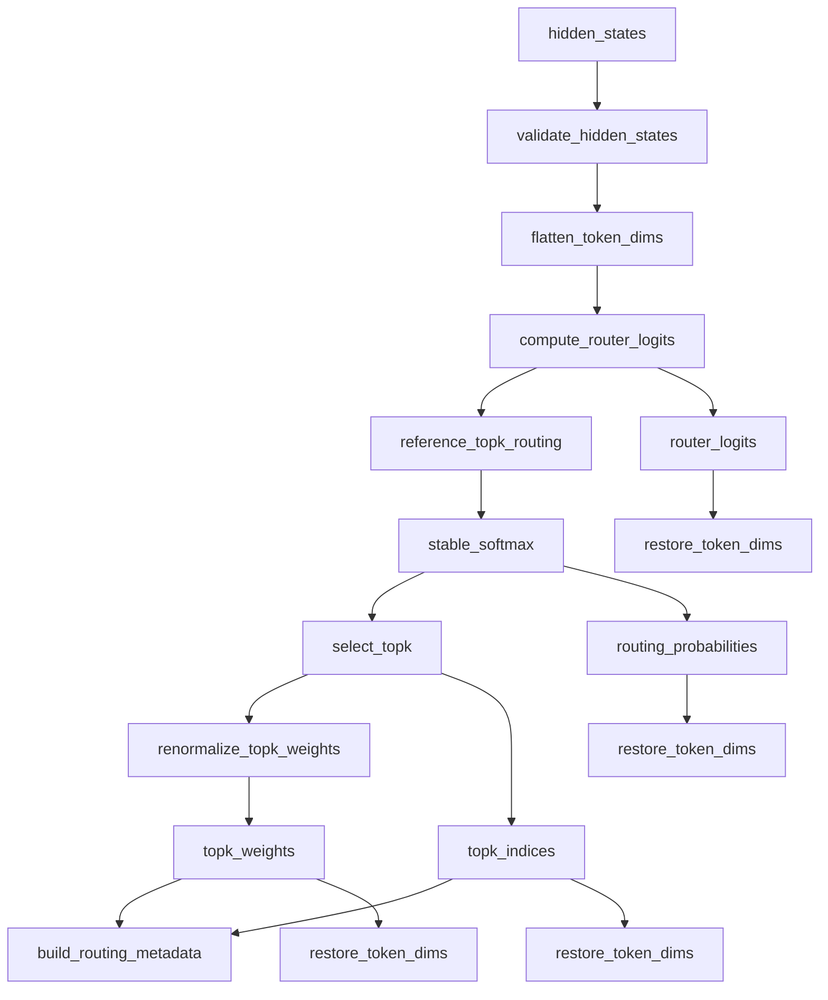
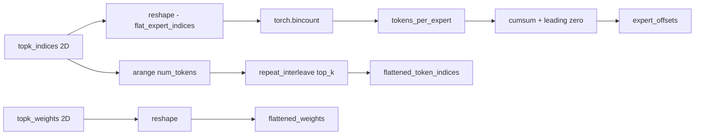

# Router Engineering Notes

## Scope

The current DWDP router implementation is a selection module.

Its responsibilities are limited to:

- computing router logits from hidden states
- converting logits into routing probabilities
- selecting top-k experts per token
- renormalizing selected weights
- materializing routing metadata

It does not perform:

- token dispatch
- expert invocation
- collective communication
- scheduling
- output merge

This separation is fundamental to the current package layout. The router decides where tokens should go; later runtime components decide how those assignments are executed.

## Current Implementation

The implementation lives in `DWDP/router` and is currently centered on a single router family:

- `LinearTopKRouter`

The reference routing path is:

1. flatten token-major hidden states to 2D
2. apply a learned linear projection to `num_experts`
3. apply softmax over experts
4. select top-k experts per token
5. optionally renormalize selected weights
6. optionally construct routing metadata
7. restore token-major output shapes

The code path is intentionally short and explicit. It is designed to be easy to replace with fused kernels while keeping the module API unchanged.

## Routing Mathematics

Let:

- `H ∈ R^{T x D}` be the flattened hidden states, where `T` is the number of tokens and `D` is `hidden_size`
- `W ∈ R^{E x D}` be the router weight matrix, where `E` is `num_experts`
- `b ∈ R^{E}` be the optional router bias

The router logits are:

```text
L = H W^T + b
```

In the current implementation, this is computed with `torch.nn.functional.linear`. If `score_scale != 1.0`, the logits are scaled after projection:

```text
L_scaled = score_scale * L
```

The routing probabilities are:

```text
P[t, e] = exp(L[t, e]) / sum_j exp(L[t, j])
```

The current code uses `torch.softmax` with an optional accumulation dtype. When `softmax_dtype` is not provided, FP16 and BF16 inputs default to FP32 accumulation through `default_softmax_dtype()`.

For each token `t`, the router then selects:

```text
I_t = TopK(P[t, :], k)
```

where `I_t` is the set of selected expert indices and the associated selected probabilities are:

```text
Q_t = P[t, I_t]
```

If `renormalize=True`, the selected weights are projected back onto the simplex:

```text
R_t = Q_t / max(sum(Q_t), eps)
```

For `top_k == 1`, the implementation directly returns a tensor of ones for the routing weights.

## Why Top-K Routing

The current package implements standard top-k routing because it matches the dominant inference pattern used by dense-gate sparse-expert systems.

Top-k routing has several useful properties in an inference runtime:

- bounded expert fan-out per token
- fixed-size selection output
- direct compatibility with dispatch plans based on per-expert counts
- straightforward mapping to GPU primitives such as softmax, top-k, bincount, and prefix sums

The current implementation selects experts from post-softmax probabilities, not directly from logits. That matches the existing code path exactly.

## Why Weight Renormalization Exists

The dense softmax produces a probability distribution over all experts:

```text
sum_e P[t, e] = 1
```

After top-k truncation, the selected subset no longer sums to one in general:

```text
sum_{e in I_t} Q[t, e] <= 1
```

Renormalization restores a normalized local distribution over the selected experts:

```text
sum_{e in I_t} R[t, e] = 1
```

This matters because downstream expert-weighted combination logic typically expects the selected routing weights to sum to one for each token. Even though dispatch and merge are outside the current package, the router returns weights in the form later stages typically consume.

The `eps` clamp is present to avoid a pathological divide-by-zero path during normalization.

## Why Metadata Is Generated Separately

Routing and dispatch are related but distinct phases.

The router computes a selection result:

- which experts were chosen
- with what weights
- how many assignments each expert received

Dispatch consumes that result and transforms it into an execution plan:

- grouping tokens by expert
- compacting token indices
- building communication payloads
- arranging buffers for expert kernels

The current implementation keeps these responsibilities separate. `build_routing_metadata()` operates on already selected top-k indices and weights and produces lightweight metadata without introducing any dispatch policy.

This keeps the router independent of:

- device mesh topology
- local-vs-global expert placement
- communication backend
- token packing format
- scheduling strategy

The current `RoutingMetadata` fields reflect exactly what the code produces today:

| Field | Meaning |
| --- | --- |
| `num_tokens` | Number of flattened tokens routed in the current call. |
| `num_experts` | Global expert count from the router configuration. |
| `top_k` | Number of selected experts per token. |
| `tokens_per_expert` | Assignment counts from `torch.bincount` over flattened expert ids. |
| `expert_offsets` | Prefix sum of `tokens_per_expert` with a leading zero. |
| `flattened_token_indices` | Token ids in token-major order, created by repeating each token id `top_k` times. |
| `flattened_expert_indices` | Flattened expert ids in token-major order. |
| `flattened_weights` | Flattened top-k weights in token-major order. |

An important detail is that full metadata is not expert-grouped. The flattened vectors remain in token-major order. A future dispatcher can reorder them if it wants expert-major packing.

## Why Kernels Are Isolated

The package contains two layers below the router class:

- `ops/`: semantic primitives
- `kernels/`: replacement boundary

`ops/` exists so the meaning of the routing steps is explicit and reusable:

- `stable_softmax()`
- `select_topk()`
- `renormalize_topk_weights()`

`kernels/fused.py` exists because production runtimes usually do not want to preserve these as separate launches forever. In the current code, `reference_topk_routing()` is still a PyTorch reference path, but it already defines the API boundary where a fused implementation can be inserted later.

This split lets the code express two different concerns cleanly:

- semantic decomposition for readability and reuse
- implementation substitution for performance

## Forward Execution Pipeline



The `LinearTopKRouter.forward()` method executes the following sequence:

### 1. Input Validation

`validate_hidden_states()` checks:

- `hidden_states.ndim >= 2`
- `hidden_states.shape[-1] == hidden_size`

No additional layout checks are performed.

### 2. Token Flattening

`flatten_token_dims()` converts any token-major prefix into a 2D matrix:

```text
[d0, d1, ..., dn, hidden_size] -> [num_tokens, hidden_size]
```

where:

```text
num_tokens = d0 * d1 * ... * dn
```

The original token shape is stored so outputs can be restored at the end of the forward pass.

### 3. Router Projection

`compute_router_logits()` applies:

```text
router_logits = F.linear(flat_hidden_states, weight, bias)
```

This produces:

```text
[num_tokens, num_experts]
```

If `score_scale != 1.0`, the logits are multiplied by `score_scale`.

### 4. Stable Softmax

`reference_topk_routing()` calls `stable_softmax()`:

```text
probabilities = softmax(router_logits, dim=-1, dtype=compute_dtype)
```

This yields a dense probability matrix over all experts for every token.

### 5. Top-K Selection

`select_topk()` wraps `torch.topk()` and returns:

- selected probabilities
- selected expert indices

Selection is along the expert dimension.

If `topk_sorted=False`, PyTorch is allowed to return selections without sorting the top-k slice.

### 6. Weight Renormalization

If `renormalize=True`, the selected probabilities are normalized across the top-k dimension.

For `top_k == 1`, the returned weights are all ones.

If `renormalize=False`, `topk_weights` is just the selected top-k probability tensor.

### 7. Metadata Materialization

`build_routing_metadata()` is driven by `MetadataLevel`:

- `NONE`: return no metadata
- `COUNTS`: return counts and offsets only
- `FULL`: return counts, offsets, and flattened token/expert/weight vectors

The current metadata build sequence is:



### 8. Shape Restoration

`restore_token_dims()` reshapes:

- `router_logits`
- `routing_probabilities`
- `topk_indices`
- `topk_weights`

back into the original token-major prefix.

If the input was `[batch, seq, hidden_size]`, the returned shapes are:

- `router_logits`: `[batch, seq, num_experts]`
- `routing_probabilities`: `[batch, seq, num_experts]`
- `topk_indices`: `[batch, seq, top_k]`
- `topk_weights`: `[batch, seq, top_k]`

## Module-Level Design Rationale

### `config.py`

`RouterConfig` exists to make routing policy explicit and immutable at construction time. A runtime component can instantiate routers from configuration objects without binding itself to a specific implementation class.

The current config also captures several performance-sensitive policy choices:

- softmax accumulation dtype
- probability output dtype
- top-k sorting policy
- metadata materialization level
- renormalization behavior

### `base.py`

`BaseRouter` is the common contract for alternate routing implementations. It ensures future routers expose the same essential surface:

- a way to compute logits from flattened tokens
- a `forward()` method returning `RouterOutput`

This is sufficient for existing router consumers to remain agnostic to the routing family.

### `linear.py`

`LinearTopKRouter` is intentionally small. All domain-specific behavior is in a single module, but implementation details such as softmax and renormalization are delegated to lower layers. This avoids monolithic forward logic while keeping call structure predictable.

### `metadata.py`

Separating metadata generation from router projection logic makes the cost of metadata explicit and optional. It also avoids embedding dispatch assumptions into the class that computes selection.

### `registry.py`

The registry decouples configuration-driven router construction from direct class imports. This becomes relevant once multiple router implementations coexist.

### `types.py`

`RouterOutput` provides a stable structured return contract. Without it, call sites would need to rely on positional tuples, which are harder to extend and easier to misuse.

### `utils.py`

Shape and dtype helpers live outside the core class to keep the routing path readable and to make future router implementations reuse the same shape contract.

## Public API

### `RouterConfig`

Construction contract for routers.

Inputs:

- dimensions: `hidden_size`, `num_experts`, `top_k`
- projection option: `bias`
- registry key: `router_type`
- numeric policy: `softmax_dtype`, `probability_dtype`, `score_scale`, `eps`
- selection policy: `topk_sorted`, `renormalize`
- metadata policy: `metadata_level`

Output:

- immutable dataclass consumed by router constructors

### `LinearTopKRouter`

PyTorch module implementing linear top-k routing.

Input:

- `hidden_states` with trailing dimension equal to `config.hidden_size`
- optional `metadata_level` override

Output:

- `RouterOutput`

Responsibilities:

- own routing parameters
- compute logits
- invoke the reference routing path
- build metadata
- restore token-major output shapes

### `RoutingMetadata`

Structured metadata derived from selected assignments.

Responsibilities:

- expose counts and offsets for downstream planning
- expose flat assignment vectors when full metadata is requested

`RoutingMetadata` does not imply any dispatch order, transport plan, or expert ownership policy.

## Performance Considerations

### Dense Probability Materialization

The current implementation materializes dense routing probabilities for all experts before top-k selection. This is simple and matches the current API, but it also means the router pays for a full `[num_tokens, num_experts]` probability tensor.

That is acceptable for the present reference path, but it is also the most obvious target for future fusion.

### Memory Movement

The forward path uses `reshape` to flatten and restore token dimensions. When the input layout is compatible, this avoids explicit copies. The package does not currently enforce contiguity.

Metadata generation introduces additional tensors:

- `tokens_per_expert`
- `expert_offsets`
- `flattened_token_indices`
- `flattened_expert_indices`
- `flattened_weights`

If only counts are needed, `MetadataLevel.COUNTS` avoids the flattened vectors. If no metadata is needed, `MetadataLevel.NONE` avoids all metadata allocations.

### Numerical Stability

Softmax stability is handled through PyTorch softmax with optional higher-precision accumulation. The default policy for FP16 and BF16 inputs is FP32 accumulation when `softmax_dtype` is unspecified.

Top-k renormalization clamps the denominator by `eps`. This is a narrow but important safeguard against pathological numerical cases.

### Compile Friendliness

The code path is close to what `torch.compile` prefers:

- a straight-line tensor graph
- no Python loops over tokens
- simple configuration-driven branching
- explicit dataclass-based configuration

The benchmark script exposes a `--compile` flag because compile behavior is part of the intended deployment model.

### GPU Execution

All core operations map to standard PyTorch CUDA kernels:

- linear projection
- softmax
- top-k
- bincount
- cumsum

The package currently contains no custom CUDA or Triton kernels. GPU execution quality therefore depends on PyTorch kernel behavior and the surrounding runtime.

## Triton and CUDA Replacement Strategy

The current code already defines where a future fused implementation should land.

### Current Boundary

`LinearTopKRouter.forward()` calls:

```python
reference_topk_routing(...)
```

That function currently performs:

1. `stable_softmax`
2. `select_topk`
3. optional `renormalize_topk_weights`

This is the intended substitution point for a fused kernel.

### Expected Future Replacement

A Triton or CUDA implementation can replace the internals of `reference_topk_routing()` while preserving:

- the function signature
- the returned tuple structure
- the semantics of `topk_sorted`, `renormalize`, `softmax_dtype`, `probability_dtype`, and `eps`

This keeps `LinearTopKRouter` unchanged and avoids propagating kernel-specific logic up into the module API.

Potential future fusion targets:

- fused softmax + top-k
- fused softmax + top-k + renormalization
- expert-local statistics materialization during selection

### Metadata Path

`build_routing_metadata()` is another candidate for future acceleration, particularly if a dispatcher eventually wants expert-grouped permutations, compact token packing, or local-expert sharding metadata.

At the moment, metadata remains a separate post-selection stage. That keeps the current package simpler and avoids constraining the future dispatcher design prematurely.

## Expected Interaction With a Future Dispatcher

The current router output is sufficient for a later dispatcher layer to build an execution plan.

The intended interaction is:

1. router returns top-k indices and weights
2. router optionally returns assignment counts and flat vectors
3. dispatcher transforms token-major assignments into expert-major or shard-major order
4. dispatcher packs token payloads and launches expert-side work

A future dispatcher is expected to consume at least the following fields:

- `topk_indices`
- `topk_weights`
- `metadata.tokens_per_expert`
- `metadata.expert_offsets`

If full metadata is requested, the dispatcher can also consume:

- `metadata.flattened_token_indices`
- `metadata.flattened_expert_indices`
- `metadata.flattened_weights`

The current router intentionally does not:

- sort assignments by expert
- compute a permutation buffer
- map global experts to local experts
- account for expert parallel groups
- account for communication topology

Those behaviors belong to dispatch and runtime orchestration, not to the selection layer.

## Extensibility

The current package already supports additional router families through:

- `BaseRouter`
- `RouterConfig.router_type`
- `register_router()`
- `build_router()`

Candidate future implementations include:

- Attention Router
- MLP Router
- Hash Router
- Sinkhorn Router
- Expert Choice Router
- Noisy Top-K Router

The addition model is straightforward:

1. implement a new `BaseRouter` subclass
2. register it under a new router type
3. preserve the existing output contract, or extend it in a backward-compatible way

This avoids modifying existing router consumers.

## Tests and Benchmarking

### Tests

`tests/router/test_linear_router.py` verifies the current API contract and routing semantics:

- output tensor shapes
- top-k normalization
- `top_k == 1` behavior
- metadata count consistency
- metadata disable path
- router logit correctness against manual linear projection
- registry behavior
- config validation

The tests do not attempt to validate dispatch, communication, or expert execution because those concerns are outside the current package.

### Benchmark

`benchmarks/benchmark_router.py` measures repeated end-to-end forward latency under `torch.no_grad()`.

Inputs:

- batch
- sequence length
- hidden size
- expert count
- top-k
- dtype
- device
- warmup count
- measured iteration count
- optional `torch.compile`

Outputs:

- average latency in microseconds
- tokens per second

This is a router-level benchmark, not a kernel microbenchmark.
