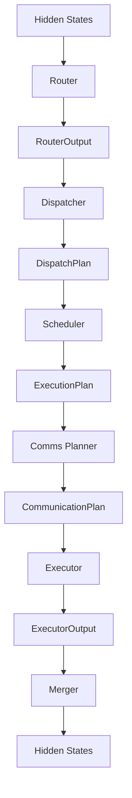
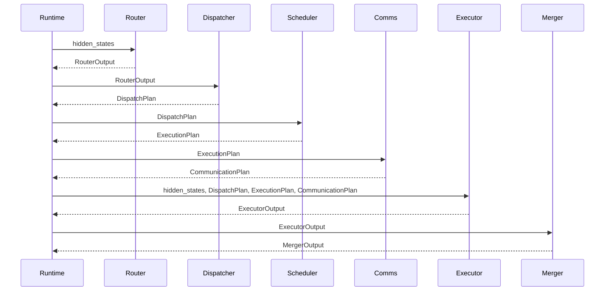
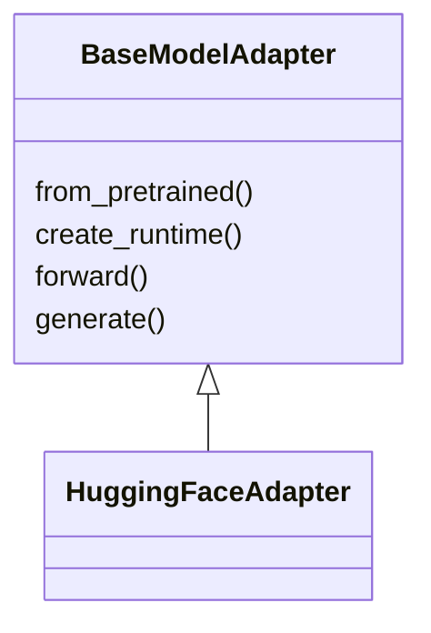

# DWDP Runtime Integration

## Scope

The DWDP Runtime Integration Layer connects the already implemented Router, Dispatcher, Scheduler, Comms Planner, Executor, and Merger into one inference backend.

It is not a new execution stage. It owns stage modules, workspaces, profiling state, and adapter state. It does not perform routing, dispatching, scheduling, communication planning, expert execution, or merging itself.



Every edge in this graph is a public typed object. The runtime never reaches through a module to inspect internal buffers or private implementation details.

## Runtime Object

`DWDPRuntime` is an `nn.Module` with six owned stage modules:

- `router`
- `dispatcher`
- `scheduler`
- `comms_planner`
- `executor`
- `merger`

The default reference constructor is:

```python
DWDPRuntime.build_reference(
    hidden_size=hidden_size,
    num_experts=num_experts,
    top_k=top_k,
    experts=experts,
)
```

This builds:

- `LinearTopKRouter`
- `ExpertMajorDispatcher`
- `RoundRobinScheduler`
- `StaticCommunicationPlanner`
- `PyTorchExecutor`
- `PyTorchMerger`

The stage implementations are not special-cased by the runtime. They are created through existing module registries and can be replaced by registering future backends.

## Forward Path

`DWDPRuntime.forward(hidden_states)` executes:



The return type is `RuntimePipelineOutput`, which includes every public stage output. This is intentional for Phase 2 correctness validation, where layer outputs, router outputs, dispatch metadata, executor outputs, merger outputs, and final hidden states must be compared against a native implementation.

## RuntimeConfig

`RuntimeConfig` is immutable and controls orchestration-level behavior:

- `backend`
- `device`
- `dtype`
- `torch_compile`
- `enable_workspace`
- `enable_profiling`
- `enable_statistics`
- `deterministic`
- `adapter`
- stage backend/policy names
- future distributed placeholders
- `world_size`
- `local_rank`

Stage-specific knobs remain in their stage configs. The runtime config selects defaults and keeps high-level orchestration stable.

## Workspace Ownership

`RuntimeContext` owns `RuntimeWorkspaces`, which contains one workspace per stateful stage:

- `DispatchWorkspace`
- `SchedulerWorkspace`
- `CommunicationPlannerWorkspace`
- `ExecutorWorkspace`
- `MergerWorkspace`

The Router does not currently require an external workspace. Workspaces are reused across inference iterations when `RuntimeConfig.enable_workspace=True`.

## Hugging Face Adapter System

The adapter system separates external model frameworks from the DWDP runtime.



`HuggingFaceAdapter` loads or wraps a Hugging Face model while preserving native behavior outside MoE. It does not modify attention, embeddings, LayerNorm, KV cache, tokenizer, or sampling.

The reference adapter supports explicit MoE binding:

```python
adapter.bind_moe_layer(
    hidden_size=4096,
    num_experts=64,
    top_k=2,
    experts=experts,
    router=router,
)
runtime = adapter.create_runtime()
```

Model-specific automatic patching is intentionally not hard-coded into `DWDPRuntime`. Future adapters should implement architecture-specific extraction and replacement:

- Qwen
- Mixtral
- DeepSeek
- DBRX
- JetMoE
- Llama-MoE
- SGLang
- TensorRT-LLM
- vLLM
- Megatron

Adding a model family should require implementing an adapter, not modifying the runtime pipeline.

## CLI

Runtime CLI files live under `DWDP/cli/` with lowercase module entrypoints under `dwdp/`.

Run:

```bash
python -m dwdp run \
    --model /path/to/model \
    --backend dwdp \
    --prompt "Hello"
```

Equivalent direct module:

```bash
python -m dwdp.run \
    --model /path/to/model \
    --backend dwdp \
    --prompt "Hello"
```

Benchmark:

```bash
python -m dwdp benchmark \
    --model /path/to/model \
    --backend hf \
    --compare dwdp
```

Profile:

```bash
python -m dwdp profile \
    --model /path/to/model \
    --prompt "Hello"
```

The CLI is reference infrastructure. It does not execute benchmarks during tests and does not assume CUDA availability.

## Correctness Harness

`DWDP.runtime.correctness` provides:

- `TensorComparison`
- `CorrectnessReport`
- `compare_tensors`

The harness records:

- max absolute error
- mean absolute error
- shape
- `allclose`

This is the basis for Phase 2 validation:

- layer output parity
- router output parity
- dispatch metadata parity
- executor output parity
- merger output parity
- generated-token parity

Generated-token parity requires model-specific adapters that replace only the MoE path inside a full HF model.

## Profiling

`RuntimeProfiler` records wall-clock durations for each stage and total runtime:

- `router_duration_us`
- `dispatcher_duration_us`
- `scheduler_duration_us`
- `comms_planner_duration_us`
- `executor_duration_us`
- `merger_duration_us`
- `total_duration_us`
- `workspace_bytes`

Future profiling layers should add:

- `torch.profiler`
- CUDA events
- memory allocator stats
- workspace high-water marks
- Nsight Systems annotations
- Nsight Compute kernel attribution

## Benchmarking

`benchmarks/runtime/benchmark_runtime.py` measures integrated reference runtime latency, throughput, and workspace bytes for synthetic MoE layers.

The benchmark is designed to compare future backends without changing the public runtime API:

- reference PyTorch
- `torch.compile`
- Triton kernels
- CUDA kernels
- grouped GEMM
- persistent kernels
- distributed execution

## Optimization Roadmap

The integration layer is deliberately stable. Optimization should happen below it.

```text
Phase 1: Reference Runtime
Phase 2: Correctness Validation
Phase 3: Profiling
Phase 4: Single GPU Optimization
Phase 5: Distributed Runtime
Phase 6: Large Scale Validation
Phase 7: Research Optimizations
```

The runtime's responsibility is to preserve the public orchestration contract while individual stages evolve from PyTorch reference implementations to optimized kernels and distributed implementations.
