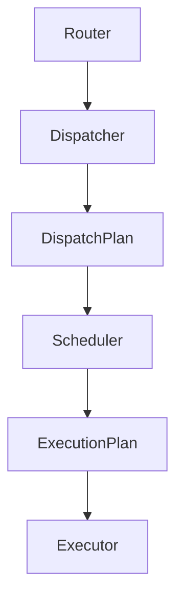
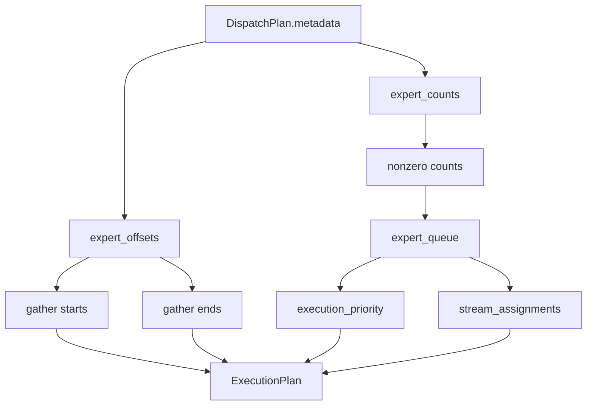

# Scheduler Engineering Notes

## Scope

The Scheduler is the planning layer between dispatch and execution.

It consumes:

```text
DispatchPlan
```

and produces:

```text
ExecutionPlan
```

The Scheduler does not:

- execute experts
- move tensors
- launch communication
- inspect router output
- inspect model weights
- merge outputs

It decides what should execute, in what order, and with what metadata.

## Runtime Boundary



The dispatcher creates expert-major layout. The scheduler creates an execution ordering over that layout.

This separation keeps the executor independent from dispatcher internals. The executor should consume only `ExecutionPlan`, not `DispatchPlan`.

## Data Model

### `ExecutionPlan`

`ExecutionPlan` is the stable executor-facing contract.

It contains:

- `execution_order`
- `expert_queue`
- `expert_starts`
- `expert_ends`
- `expert_counts`
- `execution_priority`
- `stream_assignments`
- `batches`
- `synchronization`
- `dependencies`
- `statistics`
- `scheduling_policy`
- `deterministic`

Tensor metadata is kept contiguous and compact. Python `ExecutionBatch` descriptors are materialized only when `metadata_level == FULL`.

### `ExecutionBatch`

An `ExecutionBatch` describes one expert-major work item:

```text
expert_id
start
end
count
priority
stream_id
```

It does not contain tensor payloads or model weights.

### `SynchronizationMetadata`

Contains placeholders for future synchronization planning:

- `barrier_after_batch`
- `cuda_event_ids`
- `stream_waits`

The current Round Robin implementation sets no barriers.

### `DependencyMetadata`

Contains placeholders for future dependency-aware scheduling:

- `dependency_src`
- `dependency_dst`
- `prefetch_expert_ids`
- `communication_groups`

The current Round Robin policy emits empty dependency edge lists.

### `SchedulerStatistics`

Summarizes the plan:

- number of experts
- number of active experts
- number of empty experts
- number of execution batches
- number of assignments
- maximum tokens per expert
- minimum tokens per active expert
- scheduling policy

## Round Robin Mathematics

Let:

- `E` be the number of experts
- `counts[e]` be the number of assignments routed to expert `e`
- `offsets[e]` be the start of expert `e` in expert-major layout

Round Robin constructs:

```text
active = { e | counts[e] > 0 }
```

with deterministic ascending expert order:

```text
expert_queue = sorted(active)
```

For each active expert at queue position `i`:

```text
expert_starts[i] = offsets[expert_queue[i]]
expert_ends[i] = offsets[expert_queue[i] + 1]
expert_counts[i] = counts[expert_queue[i]]
execution_priority[i] = i
stream_assignments[i] = i mod stream_count
```

The scheduler does not reorder tokens inside an expert. It only schedules expert-major ranges created by the dispatcher.

## Algorithm

The default policy executes:

1. validate `DispatchPlan`
2. compute active experts with `nonzero(expert_counts > 0)`
3. build execution order `[0, ..., active_count - 1]`
4. gather expert starts and ends from `expert_offsets`
5. gather active expert counts
6. assign priorities by queue position
7. assign stream placeholders modulo `stream_count`
8. create synchronization and dependency metadata
9. produce `ExecutionPlan`



## Why Scheduler Is Independent From Dispatcher

The dispatcher decides memory layout. The scheduler decides execution order over that layout.

Keeping them separate prevents the dispatcher from embedding policy decisions such as:

- priority ordering
- stream assignment
- prefetch order
- communication overlap
- cache-aware execution
- weight-residency decisions

The scheduler reads only the stable dispatch contract:

- expert counts
- expert offsets
- number of experts
- number of assignments

It does not need router logits, routing probabilities, hidden states, or expert weights.

## Why Executor Consumes `ExecutionPlan`

Executor should not inspect `DispatchPlan` directly because that would couple execution to dispatch layout internals and make future scheduling policies harder to add.

`ExecutionPlan` gives the executor the narrow contract it needs:

- which experts are active
- the order to process them
- the expert-major ranges to consume
- placeholder stream ids
- future dependency and barrier metadata

This lets scheduling policies evolve without changing executor code.

## Policy Abstraction

Schedulers are registered by policy name:

```text
SchedulerConfig.scheduling_policy
```

The default is:

```text
round_robin
```

Future policies can be added by implementing `BaseScheduler`, registering the class, and returning `ExecutionPlan`.

Candidate policies:

- Largest First
- Smallest First
- Load Balanced
- Greedy
- Communication Aware
- Locality Aware
- Cache Aware
- Weight Residency Aware
- Cost Model Based
- Learned Scheduling

Downstream executor code should remain unchanged if the `ExecutionPlan` contract is preserved.

## Workspace Reuse

`SchedulerWorkspace` owns reusable metadata buffers:

- execution order
- expert queue
- expert starts
- expert ends
- active expert counts
- execution priorities
- stream assignments
- barrier flags
- dependency edge buffers

This avoids repeated allocation when scheduling shapes are stable across inference iterations.

Workspace use is controlled by:

```text
SchedulerConfig.enable_workspace
```

## Kernel Replacement Boundaries

Scheduling is mostly metadata generation, but there are still replacement boundaries for device-side implementations.

Current boundary:

```text
kernels/reference.py::reference_round_robin_schedule
```

Future kernels may generate:

- active expert queues
- expert range tensors
- priority tensors
- stream assignment tensors
- dependency edge metadata
- prefetch metadata

directly on device.

The current implementation uses PyTorch tensor operations and keeps the policy logic independent from the kernel boundary.

## Future Communication-Aware Scheduling

Future communication-aware policies may use the same `ExecutionPlan` fields to encode:

- local-vs-remote expert ordering
- prefetch order
- stream waits
- event ids
- dependency edges
- communication groups
- expert-parallel group ordering

The current Round Robin policy does not implement those behaviors. It only exposes the metadata locations where those policies can write.

## Asynchronous Prefetch Integration

Weight residency and asynchronous prefetch policies can extend scheduling by filling:

- `DependencyMetadata.prefetch_expert_ids`
- `DependencyMetadata.dependency_src`
- `DependencyMetadata.dependency_dst`
- `SynchronizationMetadata.stream_waits`
- `SynchronizationMetadata.cuda_event_ids`

The executor can later consume these fields without needing to know which scheduling policy produced them.

## Benchmark

`benchmarks/benchmark_scheduler.py` measures:

- scheduler latency with workspace reuse
- scheduler latency without workspace reuse
- metadata generation cost
- active-expert scheduling throughput
- output metadata bytes
- workspace bytes

The benchmark constructs synthetic `DispatchPlan` objects and does not invoke Router, Dispatcher, Executor, communication, or expert kernels.

## Tests

`tests/scheduler/test_round_robin_scheduler.py` validates:

- deterministic ascending expert ordering
- empty expert skipping
- expert range correctness
- stream placeholder assignment
- execution batch descriptor correctness
- empty plan behavior
- workspace reuse
- disabled workspace behavior
- minimal metadata behavior
- scheduler statistics
- registry construction
- configuration validation
- invalid dispatch metadata rejection
