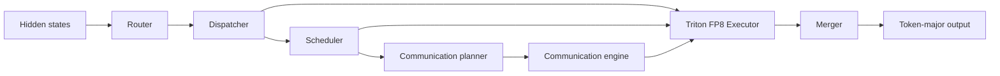

# DWDP: Distributed Weight Data Parallelism Triton-MoE Inference Engine

DWDP is an inference-oriented, high-performance Mixture-of-Experts (MoE) engine. It keeps model expert parameters in their original framework storage, routes tokens into a deterministic expert-major layout, executes local and remote experts using custom Triton grouped-GEMM kernels with native FP8 precision, and merges results back into token-major order.

---

## Key Features & Architecture

- **Storage-Preserving MoE Engine**: Preserves established *Router → Dispatcher → Scheduler → Communication Planner → Communication Engine → Executor → Merger* pipeline without duplicating model weight storage.
- **Native FP8 Precision & Micro-Scaling**: Full FP8 (E4M3 / E5M2) execution with fine-grained per-expert micro-scale factors and FP32 Tensor Core accumulation.
- **Persistent Pointer-Array Triton Kernels**: Fused gather-SwiGLU and down-projection Triton kernels consuming direct `TensorList` arrays of non-contiguous virtual memory pointers.
- **Async NVLink Prefetching & CUDA IPC**: C++20/CUDA communication engine with double-buffered physical staging areas (Buffer A/B), dedicated high-priority prefetch streams, and zero-copy CUDA IPC handles.
- **One-Command Benchmarking & Profiling**: Automated master launcher script (`scripts/run_all_benchmarks.sh`) running FP8 benchmarks, PyTorch Profiler traces, prefill/decode breakdowns, and packaging results into downloadable `.zip` archives.

---

## Runtime Pipeline



The dispatcher produces one contiguous expert-major assignment stream. The scheduler references ranges in that stream without reordering tensor data. The executor computes packed and routing-weighted outputs using persistent FP8 Triton kernels, and the merger restores the original token layout.

---

## Repository Structure

| Path | Purpose |
| --- | --- |
| `DWDP/router` | Linear top-k routing and routing metadata. |
| `DWDP/dispatcher` | Deterministic expert-major packing. |
| `DWDP/scheduler` | Reusable schedule metadata and execution order. |
| `DWDP/comms_planner` | Single-GPU and multi-GPU communication plans and topology metadata. |
| `DWDP/communication` | C++20/CUDA stream, event, cache, IPC, and residency ABI. |
| `DWDP/executor` | Persistent Triton FP8 grouped-GEMM kernels, micro-scale dequantization, workspaces, and weight views. |
| `DWDP/merger` | Packed expert-output reconstruction. |
| `DWDP/runtime` | Stage orchestration, profiling, and correctness utilities. |
| `DWDP/adapters` | Hugging Face Qwen MoE extraction and model patching. |
| `scripts` | `run_all_benchmarks.sh` and benchmark execution drivers. |
| `benchmarks` | Focused component and end-to-end benchmark drivers. |
| `tests` | Unit, contract, CUDA-gated, FP8, and stream overlap tests. |
| `docs` | Architectural documentation and `BENCHMARK_GUIDE.md`. |

---

## Installation & Build

Python 3.10 or newer is required.

```bash
python -m pip install -e .
python -m pytest -q
```

The native C++20 / CUDA communication library requires CMake 3.18+, a C++20 compiler, and CUDA Toolkit 12.x:

```bash
cmake -S DWDP/communication -B build/communication
cmake --build build/communication --parallel
```

Run test suite including stream overlap & FP8 prefetch tests:

```bash
python -m pytest -q tests/communication/test_dwdp_prefetch_overlap.py
```

---

## Quick Start (Automated FP8 Benchmark & Profiling)

Run the full automated FP8 benchmark and profiling suite for `Qwen1.5-MoE-A2.7B` with one command:

```bash
bash scripts/run_all_benchmarks.sh
```

### What this command does:
1. Validates CUDA GPU hardware and PyTorch FP8 capabilities.
2. Installs required dependencies (`transformers`, `accelerate`, `bitsandbytes`, `triton`, `safetensors`, `zip`).
3. Runs FP8 model execution (`--quantization fp8`) and measures prefill latency, decode latency, throughput ($\text{tokens/sec}$), peak VRAM, and PyTorch Profiler traces.
4. Packages results into `DWDP_FP8_Benchmark_Results_<timestamp>.zip` in the root directory and updates `results/latest_fp8_report.md`.

For customization options (e.g. running on A100/H100/L4 GPUs, changing batch sizes, or testing other models like Mixtral or DeepSeek), see [docs/BENCHMARK_GUIDE.md](file:///home/rustam/DWDP-Triton-MoE-Inference-Engine/docs/BENCHMARK_GUIDE.md).

---

## Benchmark & Profiling Methodology

Benchmark a warmed-up model with a fixed prompt, generation length, seed, precision, quantization mode, batch size, and device. Measure both native Hugging Face and DWDP in isolated model loads. Record TTFT, prefill, decode, throughput, peak allocated memory, module timing, and token parity.

Component benchmarks are in `benchmarks/`:

```bash
python benchmarks/benchmark_executor.py --device cuda
python benchmarks/benchmark_dispatcher.py --device cuda
python benchmarks/benchmark_router.py --device cuda
python benchmarks/benchmark_scheduler.py --device cuda
```
