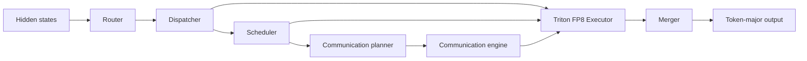

# DWDP: Distributed Weight Data Parallelism Triton-MoE Inference Engine

DWDP is an inference-oriented, high-performance Mixture-of-Experts (MoE) engine. It keeps model expert parameters in their original framework storage, routes tokens into a deterministic expert-major layout, executes local and remote experts using custom Triton grouped-GEMM kernels with native FP8 precision, and merges results back into token-major order.

---

## 🚀 Key Features & Architecture

- **Storage-Preserving MoE Engine**: Preserves the established pipeline (*Router → Dispatcher → Scheduler → Communication Planner → Communication Engine → Executor → Merger*) without duplicating model weight storage.
- **Native FP8 Precision & Micro-Scaling**: Full FP8 (E4M3 / E5M2) execution with fine-grained per-expert micro-scale factors and FP32 Tensor Core accumulation.
- **Persistent Pointer-Array Triton Kernels**: Fused gather-SwiGLU and down-projection Triton kernels consuming direct [TensorList](file:///home/rustam/DWDP-Triton-MoE-Inference-Engine/DWDP/executor/tensor_list.py) arrays of non-contiguous virtual memory pointers.
- **Async NVLink Prefetching & CUDA IPC**: C++20/CUDA communication engine with double-buffered physical staging areas (Buffer A/B), dedicated high-priority prefetch streams, and zero-copy CUDA IPC handles.
- **One-Command Benchmarking & Profiling**: Automated master launcher script ([run_all_benchmarks.sh](file:///home/rustam/DWDP-Triton-MoE-Inference-Engine/scripts/run_all_benchmarks.sh)) running FP8 benchmarks, PyTorch Profiler traces, prefill/decode breakdowns, and packaging results into downloadable `.zip` archives.

---

## 🔄 Runtime Pipeline



The dispatcher produces one contiguous expert-major assignment stream. The scheduler references ranges in that stream without reordering tensor data. The executor computes packed and routing-weighted outputs using persistent FP8 Triton kernels, and the merger restores the original token layout.

---

## 🗂️ Interactive Repository & Documentation Map

Click any link below to directly open the corresponding codebase module or architectural documentation:

| Module / Component | Implementation Code | Architectural Documentation |
| :--- | :--- | :--- |
| **Router** | [DWDP/router](file:///home/rustam/DWDP-Triton-MoE-Inference-Engine/DWDP/router) | 📖 [router.md](file:///home/rustam/DWDP-Triton-MoE-Inference-Engine/docs/router.md) |
| **Dispatcher** | [DWDP/dispatcher](file:///home/rustam/DWDP-Triton-MoE-Inference-Engine/DWDP/dispatcher) | 📖 [dispatcher.md](file:///home/rustam/DWDP-Triton-MoE-Inference-Engine/docs/dispatcher.md) |
| **Scheduler** | [DWDP/scheduler](file:///home/rustam/DWDP-Triton-MoE-Inference-Engine/DWDP/scheduler) | 📖 [scheduler.md](file:///home/rustam/DWDP-Triton-MoE-Inference-Engine/docs/scheduler.md) |
| **Communication Planner** | [DWDP/comms_planner](file:///home/rustam/DWDP-Triton-MoE-Inference-Engine/DWDP/comms_planner) | 📖 [comms_planner.md](file:///home/rustam/DWDP-Triton-MoE-Inference-Engine/docs/comms_planner.md) |
| **CUDA Communication Engine** | [DWDP/communication](file:///home/rustam/DWDP-Triton-MoE-Inference-Engine/DWDP/communication) | 📖 [buffers.h](file:///home/rustam/DWDP-Triton-MoE-Inference-Engine/DWDP/communication/buffers.h) / [ipc.h](file:///home/rustam/DWDP-Triton-MoE-Inference-Engine/DWDP/communication/ipc.h) |
| **Triton FP8 Executor** | [DWDP/executor](file:///home/rustam/DWDP-Triton-MoE-Inference-Engine/DWDP/executor) | 📖 [executor.md](file:///home/rustam/DWDP-Triton-MoE-Inference-Engine/docs/executor.md) |
| **Merger** | [DWDP/merger](file:///home/rustam/DWDP-Triton-MoE-Inference-Engine/DWDP/merger) | 📖 [merger.md](file:///home/rustam/DWDP-Triton-MoE-Inference-Engine/docs/merger.md) |
| **Runtime Orchestrator** | [DWDP/runtime](file:///home/rustam/DWDP-Triton-MoE-Inference-Engine/DWDP/runtime) | 📖 [runtime.md](file:///home/rustam/DWDP-Triton-MoE-Inference-Engine/docs/runtime.md) |
| **Hugging Face Adapters** | [DWDP/adapters](file:///home/rustam/DWDP-Triton-MoE-Inference-Engine/DWDP/adapters) | 📖 [adapters.md](file:///home/rustam/DWDP-Triton-MoE-Inference-Engine/docs/adapters.md) |
| **Benchmarking Suite** | [scripts/](file:///home/rustam/DWDP-Triton-MoE-Inference-Engine/scripts) / [benchmarks/](file:///home/rustam/DWDP-Triton-MoE-Inference-Engine/benchmarks) | 📖 [BENCHMARK_GUIDE.md](file:///home/rustam/DWDP-Triton-MoE-Inference-Engine/docs/BENCHMARK_GUIDE.md) |
| **Proof-of-Work Results** | [results/](file:///home/rustam/DWDP-Triton-MoE-Inference-Engine/results) | 📊 [latest_fp8_report.md](file:///home/rustam/DWDP-Triton-MoE-Inference-Engine/results/latest_fp8_report.md) |

---

## 💻 Quick Start (Automated FP8 Benchmark & Profiling)

Run the full automated FP8 benchmark and profiling suite for `Qwen1.5-MoE-A2.7B` with one command:

```bash
bash scripts/run_all_benchmarks.sh
```

### What this command does:
1. Validates CUDA GPU hardware and PyTorch FP8 capabilities.
2. Installs required dependencies (`transformers`, `accelerate`, `bitsandbytes`, `triton`, `safetensors`, `zip`).
3. Runs FP8 model execution (`--quantization fp8`) via [benchmark_colab.py](file:///home/rustam/DWDP-Triton-MoE-Inference-Engine/scripts/benchmark_colab.py) and measures prefill latency, decode latency, throughput ($\text{tokens/sec}$), peak VRAM, and PyTorch Profiler traces.
4. Packages results into `DWDP_FP8_Benchmark_Results_<timestamp>.zip` in the root directory and updates [latest_fp8_report.md](file:///home/rustam/DWDP-Triton-MoE-Inference-Engine/results/latest_fp8_report.md).

For customization options (e.g. running on A100/H100/L4 GPUs, changing batch sizes, or testing other models like Mixtral or DeepSeek), click to open the [BENCHMARK_GUIDE.md](file:///home/rustam/DWDP-Triton-MoE-Inference-Engine/docs/BENCHMARK_GUIDE.md).

---

## ⚡ Component Benchmarks

You can run individual stage benchmarks directly from the [benchmarks/](file:///home/rustam/DWDP-Triton-MoE-Inference-Engine/benchmarks) folder:

- **Executor Benchmark**: [benchmark_executor.py](file:///home/rustam/DWDP-Triton-MoE-Inference-Engine/benchmarks/benchmark_executor.py)
  ```bash
  python benchmarks/benchmark_executor.py --device cuda
  ```
- **Dispatcher Benchmark**: [benchmark_dispatcher.py](file:///home/rustam/DWDP-Triton-MoE-Inference-Engine/benchmarks/benchmark_dispatcher.py)
  ```bash
  python benchmarks/benchmark_dispatcher.py --device cuda
  ```
- **Router Benchmark**: [benchmark_router.py](file:///home/rustam/DWDP-Triton-MoE-Inference-Engine/benchmarks/benchmark_router.py)
  ```bash
  python benchmarks/benchmark_router.py --device cuda
  ```
- **Scheduler Benchmark**: [benchmark_scheduler.py](file:///home/rustam/DWDP-Triton-MoE-Inference-Engine/benchmarks/benchmark_scheduler.py)
  ```bash
  python benchmarks/benchmark_scheduler.py --device cuda
  ```

---

## 🧪 Tests & Verification

Run CUDA-gated stream overlap and FP8 prefetching tests:

```bash
python -m pytest -q tests/communication/test_dwdp_prefetch_overlap.py
```
