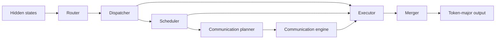

# DWDP: Distributed Weight Data Parallelism

DWDP is an inference-oriented Mixture-of-Experts runtime. It keeps the model's
expert parameters in their original framework storage, routes tokens into a
deterministic expert-major layout, executes local experts, and merges the
results back into token-major order. The current production target is a
single-GPU PyTorch runtime; the communication subsystem defines the C++20/CUDA
ABI used for future multi-GPU residency and transfer execution.

## Design philosophy

- Preserve the established Router → Dispatcher → Scheduler → Communication
  Planner → Communication Engine → Executor → Merger architecture.
- Keep routing and packing deterministic so correctness is auditable.
- Reuse device workspaces and avoid host synchronization in inference paths.
- Treat metadata as a cost: materialize only the representation consumed by
  the next stage.
- Keep model weights storage-preserving; never silently duplicate an MoE
  checkpoint merely to select an execution backend.

## Runtime pipeline



The dispatcher produces one contiguous expert-major assignment stream. The
scheduler refers to ranges in that stream; it does not reorder tensor data.
The executor writes packed and routing-weighted outputs in the same order, and
the merger restores the original token layout.

## Repository structure

| Path | Purpose |
| --- | --- |
| `DWDP/router` | Linear top-k routing and routing metadata. |
| `DWDP/dispatcher` | Deterministic expert-major packing. |
| `DWDP/scheduler` | Reusable schedule metadata and execution order. |
| `DWDP/comms_planner` | Single-GPU communication plans and topology metadata. |
| `DWDP/communication` | C++20/CUDA stream, event, cache, IPC, and residency ABI. |
| `DWDP/executor` | Local expert execution, workspaces, weight views, and grouped-GEMM kernels. |
| `DWDP/merger` | Packed expert-output reconstruction. |
| `DWDP/runtime` | Stage orchestration, profiling, and correctness utilities. |
| `DWDP/adapters` | Hugging Face Qwen MoE extraction and model patching. |
| `benchmarks` | Focused component and end-to-end benchmark drivers. |
| `tests` | Unit, contract, CUDA-gated, and integration tests. |
| `docs` | Module and phase documentation. |

## Installation and build

Python 3.10 or newer is required.

```bash
python -m pip install -e .
python -m pytest -q
```

The optional native communication library requires CMake 3.18+, a C++20
compiler, and a CUDA toolkit:

```bash
cmake -S DWDP/communication -B build/communication
cmake --build build/communication --parallel
```

Run CUDA-dependent tests only on a CUDA host:

```bash
python -m pytest -q tests/executor/test_triton_expert_executor.py
```

## Supported environment

The Python runtime supports CPU correctness tests and CUDA execution through
PyTorch. The native communication library targets CUDA 12.x and C++20. The
included full-model benchmark was designed for an NVIDIA T4 with 16 GB VRAM,
FP16 compute, and 4-bit NF4 model weights. Ampere-or-newer GPUs are required
for BF16 Tensor Core validation. Triton is optional for the CUDA-gated grouped
matmul benchmark and must match the installed PyTorch/CUDA environment.

## Quick start

```bash
python -m dwdp run --model /path/to/model --backend dwdp --prompt "Hello"
python -m dwdp benchmark --model /path/to/model --backend hf --compare dwdp
python -m dwdp profile --model /path/to/model --prompt "Hello"
```

For a reproducible Qwen T4 comparison:

```bash
bash scripts/benchmark_colab.sh --warmup 2 --iters 5
```

The command writes a timestamped directory under `results/` containing JSON,
Markdown, correctness, environment, memory, runtime-breakdown, and profiler
artifacts. Use `--no-profile` only when collecting a quick latency sample.

## Benchmark methodology

Benchmark a warmed-up model with a fixed prompt, generation length, seed,
precision, quantization mode, batch size, and device. Measure both native
Hugging Face and DWDP in isolated model loads. Record TTFT, prefill, decode,
throughput, peak allocated memory, module timing, and output/token parity.
CUDA timings must synchronize only at measurement boundaries; no benchmark is
valid if it includes compilation, download, or first-use initialization.

Focused component benchmarks are in `benchmarks/`:

```bash
python benchmarks/benchmark_executor.py --device cuda
python benchmarks/benchmark_dispatcher.py --device cuda
python benchmarks/benchmark_router.py --device cuda
python benchmarks/benchmark_scheduler.py --device cuda
```

## Profiling

Set runtime profiling only for trace collection; normal inference deliberately
does not create `record_function` ranges. The Colab driver writes
`profiler.json`, grouping launcher, gather, GEMM, copy, synchronization, and
DWDP-stage operators. Use Nsight Systems for stream-level timelines and Nsight
Compute for kernel occupancy and memory analysis.

## Optimization strategy

Phase 2 prioritizes the executor because its historical profile is the largest
runtime component. Current hot-path measures include persistent workspaces,
direct weighted-output writes, cached expert handles, compact schedule
materialization, minimal router/scheduler metadata in the runtime path, and no
default profiling scopes. Changes must retain output parity and be retained
only after benchmark comparison on CUDA hardware.

## Current limitations and roadmap

The default executor intentionally retains a small Python loop over active
experts. Hugging Face Qwen experts may be independently stored modules and may
use bitsandbytes quantized linear layers; PyTorch cannot batch arbitrary module
calls without either changing their storage format or invoking a compatible
grouped kernel. DWDP therefore does not materialize duplicated packed weights
on the production path. The existing Triton grouped-matmul code is a
CUDA-gated kernel benchmark boundary, not a replacement for quantized HF
experts.

The next execution backend requires a storage-preserving pointer-array or
quantization-aware grouped GEMM implementation, validated against the model's
native kernels. Multi-GPU weight transfers are represented by the native
communication ABI but are not enabled by the single-GPU Python execution path.
