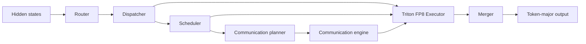

# DWDP: Distributed Weight Data Parallelism Triton-MoE Inference Engine

DWDP is an inference-oriented, high-performance Mixture-of-Experts (MoE) engine. It keeps model expert parameters in their original framework storage, routes tokens into a deterministic expert-major layout, executes local and remote experts using custom Triton grouped-GEMM kernels with native FP8 precision, and merges results back into token-major order.

---

## 🚀 Key Features & Architecture

- **Storage-Preserving MoE Engine**: Preserves the established pipeline (*Router → Dispatcher → Scheduler → Communication Planner → Communication Engine → Executor → Merger*) without duplicating model weight storage.
- **Native FP8 Precision & Micro-Scaling**: Full FP8 (E4M3 / E5M2) execution with fine-grained per-expert micro-scale factors and FP32 Tensor Core accumulation.
- **VRAM Capacity Estimator & Auto-Precision Fallback**: Automatically inspects total GPU VRAM via `nvidia-smi` / `torch.cuda` and calculates combined model parameter memory, KV cache footprint ($2 \times \text{layers} \times \text{heads} \times \text{head-dim} \times \text{tokens} \times \text{batch-size} \times 2\text{ bytes}$), and workspace overhead. If FP8 exceeds available VRAM or hardware compute capability $< 8.9$ (non-Ada/Hopper), it automatically falls back to 4-bit (NF4 / NVFP4) quantization to prevent Out-Of-Memory (OOM) errors.
- **Persistent Pointer-Array Triton Kernels**: Fused gather-SwiGLU and down-projection Triton kernels consuming direct [TensorList](https://github.com/RustamSheoran/DWDP-Triton-MoE-Inference-Engine/blob/main/DWDP/executor/tensor_list.py) arrays of non-contiguous virtual memory pointers.
- **Async NVLink Prefetching & CUDA IPC**: C++20/CUDA communication engine with double-buffered physical staging areas (Buffer A/B), dedicated high-priority prefetch streams, and zero-copy CUDA IPC handles.
- **One-Command Benchmarking & Profiling**: Automated master launcher script ([run_all_benchmarks.sh](https://github.com/RustamSheoran/DWDP-Triton-MoE-Inference-Engine/blob/main/scripts/run_all_benchmarks.sh)) running FP8 benchmarks, PyTorch Profiler traces, prefill/decode breakdowns, and packaging results into downloadable `.zip` archives.

---

## 🔄 Runtime Pipeline



The dispatcher produces one contiguous expert-major assignment stream. The scheduler references ranges in that stream without reordering tensor data. The executor computes packed and routing-weighted outputs using persistent FP8 Triton kernels, and the merger restores the original token layout.

---

## 🧠 VRAM Estimation & Auto-Quantization Switching

Before loading models, the engine evaluates available VRAM and GPU hardware capabilities to prevent Out-Of-Memory (OOM) failures:

### 1. Memory Calculation Formula
$$\text{Required VRAM} = \text{Model Weight Memory} + \text{KV Cache Footprint} + \text{CUDA Workspace Buffer (1.5 GB)}$$

where KV Cache memory is estimated as:
$$\text{KV Cache} = 2 \times \text{layers} \times \text{heads} \times \text{head-dim} \times (\text{seq-len} + \text{max-new-tokens}) \times \text{batch-size} \times 2\text{ bytes}$$

### 2. Automatic Precision Selection
- **FP8 (E4M3)**: Activated if GPU Compute Capability $\ge 8.9$ (Ada / Hopper / Blackwell) AND total GPU VRAM $\ge \text{Required VRAM}$.
- **4-bit (NF4 / NVFP4)**: Automatically activated if FP8 exceeds VRAM or GPU compute capability $< 8.9$ (e.g. Tesla T4, RTX 3090, A100), ensuring zero Out-Of-Memory (OOM) crashes.


---

## 🗂️ Interactive Repository & Documentation Map

Click any link below to directly navigate to the corresponding GitHub file or documentation page:

| Module / Component | Implementation Code | Architectural Documentation |
| :--- | :--- | :--- |
| **Router** | [DWDP/router](https://github.com/RustamSheoran/DWDP-Triton-MoE-Inference-Engine/tree/main/DWDP/router) | 📖 [router.md](https://github.com/RustamSheoran/DWDP-Triton-MoE-Inference-Engine/blob/main/docs/router.md) |
| **Dispatcher** | [DWDP/dispatcher](https://github.com/RustamSheoran/DWDP-Triton-MoE-Inference-Engine/tree/main/DWDP/dispatcher) | 📖 [dispatcher.md](https://github.com/RustamSheoran/DWDP-Triton-MoE-Inference-Engine/blob/main/docs/dispatcher.md) |
| **Scheduler** | [DWDP/scheduler](https://github.com/RustamSheoran/DWDP-Triton-MoE-Inference-Engine/tree/main/DWDP/scheduler) | 📖 [scheduler.md](https://github.com/RustamSheoran/DWDP-Triton-MoE-Inference-Engine/blob/main/docs/scheduler.md) |
| **Communication Planner** | [DWDP/comms_planner](https://github.com/RustamSheoran/DWDP-Triton-MoE-Inference-Engine/tree/main/DWDP/comms_planner) | 📖 [comms_planner.md](https://github.com/RustamSheoran/DWDP-Triton-MoE-Inference-Engine/blob/main/docs/comms_planner.md) |
| **CUDA Communication Engine** | [DWDP/communication](https://github.com/RustamSheoran/DWDP-Triton-MoE-Inference-Engine/tree/main/DWDP/communication) | 📖 [buffers.h](https://github.com/RustamSheoran/DWDP-Triton-MoE-Inference-Engine/blob/main/DWDP/communication/buffers.h) / [ipc.h](https://github.com/RustamSheoran/DWDP-Triton-MoE-Inference-Engine/blob/main/DWDP/communication/ipc.h) |
| **Triton FP8 Executor** | [DWDP/executor](https://github.com/RustamSheoran/DWDP-Triton-MoE-Inference-Engine/tree/main/DWDP/executor) | 📖 [executor.md](https://github.com/RustamSheoran/DWDP-Triton-MoE-Inference-Engine/blob/main/docs/executor.md) |
| **Merger** | [DWDP/merger](https://github.com/RustamSheoran/DWDP-Triton-MoE-Inference-Engine/tree/main/DWDP/merger) | 📖 [merger.md](https://github.com/RustamSheoran/DWDP-Triton-MoE-Inference-Engine/blob/main/docs/merger.md) |
| **Runtime Orchestrator** | [DWDP/runtime](https://github.com/RustamSheoran/DWDP-Triton-MoE-Inference-Engine/tree/main/DWDP/runtime) | 📖 [runtime.md](https://github.com/RustamSheoran/DWDP-Triton-MoE-Inference-Engine/blob/main/docs/runtime.md) |
| **Hugging Face Adapters** | [DWDP/adapters](https://github.com/RustamSheoran/DWDP-Triton-MoE-Inference-Engine/tree/main/DWDP/adapters) | 📖 [adapters.md](https://github.com/RustamSheoran/DWDP-Triton-MoE-Inference-Engine/blob/main/docs/adapters.md) |
| **Benchmarking Suite** | [scripts/](https://github.com/RustamSheoran/DWDP-Triton-MoE-Inference-Engine/tree/main/scripts) / [benchmarks/](https://github.com/RustamSheoran/DWDP-Triton-MoE-Inference-Engine/tree/main/benchmarks) | 📖 [BENCHMARK_GUIDE.md](https://github.com/RustamSheoran/DWDP-Triton-MoE-Inference-Engine/blob/main/docs/BENCHMARK_GUIDE.md) |
| **Proof-of-Work Results** | [benchmark-results/](https://github.com/RustamSheoran/DWDP-Triton-MoE-Inference-Engine/tree/main/benchmark-results) | 📊 [Timestamped Benchmark Results](https://github.com/RustamSheoran/DWDP-Triton-MoE-Inference-Engine/tree/main/benchmark-results) |

---

## ☁️ Running on Google Colab

To run the automated FP8 benchmark directly in a Google Colab notebook cell (includes automatic model download and browser `.zip` artifact download):

```python
# 1. Clone the repository into Google Colab
!git clone https://github.com/RustamSheoran/DWDP-Triton-MoE-Inference-Engine.git

# 2. Change working directory to the repo root
%cd DWDP-Triton-MoE-Inference-Engine

# 3. Launch the master benchmark suite (automatically triggers browser zip download when finished)
!bash scripts/run_all_benchmarks.sh
```

---

## 💻 Local Quick Start & Parameter Customization

Run the full automated benchmark and profiling suite locally with one command:

```bash
bash scripts/run_all_benchmarks.sh
```

### Customizing Arguments & Environment Variables

You can customize any benchmark parameter (model name, precision, iterations, batch size, etc.) directly on the command line:

```bash
# Example 1: Custom iterations & batch size on Tesla T4
MODEL="Qwen/Qwen1.5-MoE-A2.7B" QUANT="e4m3" ITERS=5 BATCH_SIZE=1 bash scripts/run_all_benchmarks.sh

# Example 2: High-throughput benchmark on A100 / H100 / L4 GPUs
MODEL="mistralai/Mixtral-8x7B-v0.1" QUANT="e4m3" ITERS=20 BATCH_SIZE=4 SEQ_LEN=512 MAX_NEW_TOKENS=256 bash scripts/run_all_benchmarks.sh
```

### What `run_all_benchmarks.sh` automatically does:
1. **GPU & Memory Pre-flight**: Inspects GPU VRAM (`nvidia-smi` / `torch.cuda`) and automatically sets fast default iterations (`WARMUP=2`, `ITERS=5`) on Tesla T4 or $\le 16$ GB GPUs so runs finish quickly.
2. **Auto-Precision Selection**: Estimates combined model weights, KV cache footprint, and workspace buffer size. Runs native FP8 (E4M3) if hardware & VRAM permit; otherwise automatically falls back to 4-bit (NF4 / NVFP4) to avoid Out-Of-Memory (OOM) failures.
3. **Dependency & Model Auto-download**: Downloads Hugging Face model weights and installs missing Python dependencies (`transformers`, `accelerate`, `bitsandbytes`, `triton`, `safetensors`, `zip`).
4. **FP8 Execution & Profiling**: Runs model execution via [benchmark_colab.py](https://github.com/RustamSheoran/DWDP-Triton-MoE-Inference-Engine/blob/main/scripts/benchmark_colab.py) and measures prefill latency, decode latency, throughput ($\text{tokens/sec}$), peak VRAM, and PyTorch Profiler traces.
5. **Zip Archiving & Colab Auto-Download**: Bundles all benchmark results into a dynamically named archive (`DWDP_<precision>_<1xGPU|cluster--NxGPU>_Benchmark_Results_<timestamp>.zip`) in the root directory and triggers automatic browser download on Google Colab (`google.colab.files.download`).

For more details, see [BENCHMARK_GUIDE.md](https://github.com/RustamSheoran/DWDP-Triton-MoE-Inference-Engine/blob/main/docs/BENCHMARK_GUIDE.md).

---

## ⚡ Component Benchmarks

You can run individual stage benchmarks directly from the [benchmarks/](https://github.com/RustamSheoran/DWDP-Triton-MoE-Inference-Engine/tree/main/benchmarks) folder:

- **Executor Benchmark**: [benchmark_executor.py](https://github.com/RustamSheoran/DWDP-Triton-MoE-Inference-Engine/blob/main/benchmarks/benchmark_executor.py)
  ```bash
  python benchmarks/benchmark_executor.py --device cuda
  ```
- **Dispatcher Benchmark**: [benchmark_dispatcher.py](https://github.com/RustamSheoran/DWDP-Triton-MoE-Inference-Engine/blob/main/benchmarks/benchmark_dispatcher.py)
  ```bash
  python benchmarks/benchmark_dispatcher.py --device cuda
  ```
- **Router Benchmark**: [benchmark_router.py](https://github.com/RustamSheoran/DWDP-Triton-MoE-Inference-Engine/blob/main/benchmarks/benchmark_router.py)
  ```bash
  python benchmarks/benchmark_router.py --device cuda
  ```
- **Scheduler Benchmark**: [benchmark_scheduler.py](https://github.com/RustamSheoran/DWDP-Triton-MoE-Inference-Engine/blob/main/benchmarks/benchmark_scheduler.py)
  ```bash
  python benchmarks/benchmark_scheduler.py --device cuda
  ```

---

## 🧪 Tests & Verification

Run CUDA-gated stream overlap and FP8 prefetching tests:

```bash
python -m pytest -q tests/communication/test_dwdp_prefetch_overlap.py
```
