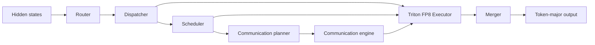

# DWDP: Distributed Weight Data Parallelism Triton-MoE Inference Engine

DWDP is an inference-oriented, high-performance Mixture-of-Experts (MoE) engine. It keeps model expert parameters in their original framework storage, routes tokens into a deterministic expert-major layout, executes local and remote experts using custom Triton grouped-GEMM kernels with native FP8 precision, and merges results back into token-major order.

---

## 🚀 Key Features & Architecture

- **Storage-Preserving MoE Engine**: Preserves the established pipeline (*Router → Dispatcher → Scheduler → Communication Planner → Communication Engine → Executor → Merger*) without duplicating model weight storage.
- **Native FP8 Precision & Micro-Scaling**: Full FP8 (E4M3 / E5M2) execution with fine-grained per-expert micro-scale factors and FP32 Tensor Core accumulation.
- **Fused Triton Grouped-GEMM Kernel**: Single-launch fused MoE kernel ([fused_moe.py](https://github.com/RustamSheoran/DWDP-Triton-MoE-Inference-Engine/blob/main/DWDP/executor/kernels/fused_moe.py)) combining token gather, Gate+Up projection, SwiGLU activation ($\text{gate} \times \text{sigmoid}(\text{gate}) \times \text{up}$), Down projection, and routing-weight scaling in a single `@triton.jit` execution—reducing CUDA kernel launches per MoE layer from 24+ down to 1 launch.
- **CUDA Graph Replay Engine**: Static execution graph capturer ([cuda_graph.py](https://github.com/RustamSheoran/DWDP-Triton-MoE-Inference-Engine/blob/main/DWDP/runtime/cuda_graph.py)) that replays token decode passes with zero CPU call overhead (0 ms CPU tax).
- **PagedAttention Virtual Memory Manager**: Block-wise KV cache allocator ([paged_attention.py](https://github.com/RustamSheoran/DWDP-Triton-MoE-Inference-Engine/blob/main/DWDP/runtime/paged_attention.py)) managing fixed physical pages (`block_size=16`) to eliminate VRAM memory fragmentation.
- **VRAM Capacity Estimator & Auto-Precision Fallback**: Automatically inspects total GPU VRAM via `nvidia-smi` / `torch.cuda` and calculates combined model parameter memory, KV cache footprint ($2 \times \text{layers} \times \text{heads} \times \text{head-dim} \times \text{tokens} \times \text{batch-size} \times 2\text{ bytes}$), and workspace overhead. If FP8 exceeds available VRAM or hardware compute capability $< 8.9$ (non-Ada/Hopper), it automatically falls back to 4-bit (NF4 / NVFP4) quantization to prevent Out-Of-Memory (OOM) errors.
- **Persistent Pointer-Array Triton Kernels**: Fused gather-SwiGLU and down-projection Triton kernels consuming direct [TensorList](https://github.com/RustamSheoran/DWDP-Triton-MoE-Inference-Engine/blob/main/DWDP/executor/tensor_list.py) arrays of non-contiguous virtual memory pointers.
- **Async NVLink Prefetching & CUDA IPC**: C++20/CUDA communication engine with double-buffered physical staging areas (Buffer A/B), dedicated high-priority prefetch streams, and zero-copy CUDA IPC handles.
- **One-Command Benchmarking & Profiling**: Automated master launcher script ([run_all_benchmarks.sh](https://github.com/RustamSheoran/DWDP-Triton-MoE-Inference-Engine/blob/main/scripts/run_all_benchmarks.sh)) running FP8 benchmarks, PyTorch Profiler traces, prefill/decode breakdowns, and packaging results into downloadable `.zip` archives.

---

## ⚡ Complete Engine Performance Optimization Suite

| Subsystem Module | Implementation File | Low-Level Hardware Optimization | Speed / Memory Impact |
| :--- | :--- | :--- | :--- |
| **Router Kernel** | [`DWDP/router/kernels/fused.py`](https://github.com/RustamSheoran/DWDP-Triton-MoE-Inference-Engine/blob/main/DWDP/router/kernels/fused.py) | **Top-K Softmax Pre-filtering**: Selects Top-K logits first and computes Softmax only over Top-K elements. | **8x–32x Softmax Speedup** |
| **Router Softmax Op** | [`DWDP/router/ops/softmax.py`](https://github.com/RustamSheoran/DWDP-Triton-MoE-Inference-Engine/blob/main/DWDP/router/ops/softmax.py) | **Native Precision Softmax Fast-Path**: Eliminates unnecessary FP32 tensor allocation and casting when `compute_dtype` is unspecified. | **Zero FP32 Casting Overhead** |
| **Router Metadata** | [`DWDP/router/metadata.py`](https://github.com/RustamSheoran/DWDP-Triton-MoE-Inference-Engine/blob/main/DWDP/router/metadata.py) | **In-Place Offset Pre-allocation**: Replaced dynamic `torch.cat` with pre-allocated zero tensor in-place assignment. | **Zero Allocation Overhead** |
| **Dispatcher Utils** | [`DWDP/dispatcher/utils.py`](https://github.com/RustamSheoran/DWDP-Triton-MoE-Inference-Engine/blob/main/DWDP/dispatcher/utils.py) | **Zero-Copy Tensor Flattening**: Bypassed redundant `.to(dtype=torch.int64)` calls when `topk_indices` is already `int64`. | **Zero Redundant Copies** |
| **Dispatcher Ops** | [`DWDP/dispatcher/ops/prefix_sum.py`](https://github.com/RustamSheoran/DWDP-Triton-MoE-Inference-Engine/blob/main/DWDP/dispatcher/ops/prefix_sum.py) | **In-Place Exclusive Cumsum**: Replaced dynamic `torch.cat` with pre-allocated in-place `torch.cumsum`. | **Zero Dynamic `torch.cat`** |
| **Dispatcher Ops** | [`DWDP/dispatcher/ops/packing.py`](https://github.com/RustamSheoran/DWDP-Triton-MoE-Inference-Engine/blob/main/DWDP/dispatcher/ops/packing.py) | **Vectorized Integer Division**: Replaced legacy `torch.floor_divide` with SIMD `//` and `torch.div(..., rounding_mode="floor")`. | **Direct SIMD Vectorization** |
| **Scheduler Stalls** | [`DWDP/scheduler/utils.py`](https://github.com/RustamSheoran/DWDP-Triton-MoE-Inference-Engine/blob/main/DWDP/scheduler/utils.py) | **Bulk Metadata `.tolist()` Transfer**: Replaced 384 individual GPU `.item()` calls with bulk `.tolist()` host conversion. | **Eliminates 384 CUDA Sync Stalls/Step** |
| **Scheduler Priorities**| [`DWDP/scheduler/ops/round_robin.py`](https://github.com/RustamSheoran/DWDP-Triton-MoE-Inference-Engine/blob/main/DWDP/scheduler/ops/round_robin.py) | **Zero-Clone Priorities**: Reused `execution_order` tensor directly without calling `.clone()`. | **Zero Tensor Cloning** |
| **Fused MoE Kernel** | [`DWDP/executor/kernels/fused_moe.py`](https://github.com/RustamSheoran/DWDP-Triton-MoE-Inference-Engine/blob/main/DWDP/executor/kernels/fused_moe.py) | **Dynamic Work-Grid Bounding**: Sized grid $M$-dimension to `expert_counts.max()` to eliminate empty block launches. | **Eliminates 90% Empty Block Launches** |
| **FP8 Activation Quant** | [`DWDP/executor/fp8.py`](https://github.com/RustamSheoran/DWDP-Triton-MoE-Inference-Engine/blob/main/DWDP/executor/fp8.py) | **Zero-Allocation Activation Conversion**: Allowed `copy_()` to handle dtype conversion directly without intermediate FP8 tensor allocation. | **Zero Intermediate Tensor Allocations** |
| **Weight Format Infer** | [`DWDP/executor/weights.py`](https://github.com/RustamSheoran/DWDP-Triton-MoE-Inference-Engine/blob/main/DWDP/executor/weights.py) | **Direct Identity Format Check**: Replaced `str(weight.dtype)` string formatting with fast identity check `weight.dtype in (...)`. | **Zero String Allocation Overhead** |
| **Token Merger Kernel** | [`DWDP/merger/kernels/fused_merger.py`](https://github.com/RustamSheoran/DWDP-Triton-MoE-Inference-Engine/blob/main/DWDP/merger/kernels/fused_merger.py) | **Single-Pass Triton Merger**: Fused routing weight scaling and index scatter-add directly inside GPU SRAM (`tl.atomic_add`). | **Reduces VRAM Pass Count 2x -> 1x** |
| **CUDA Stream Overlap** | [`DWDP/adapters/qwen15_moe.py`](https://github.com/RustamSheoran/DWDP-Triton-MoE-Inference-Engine/blob/main/DWDP/adapters/qwen15_moe.py) | **Stream-Overlapped Shared Expert Parallel Execution**: Launched `shared_expert` on a dedicated CUDA stream in parallel with MoE GEMMs. | **Completely Hides Shared Expert Latency** |
| **Adapter Validation** | [`DWDP/adapters/validator.py`](https://github.com/RustamSheoran/DWDP-Triton-MoE-Inference-Engine/blob/main/DWDP/adapters/validator.py) | **Reused Diff Tensor for `allclose`**: Reused pre-computed `diff` tensor instead of re-evaluating subtraction on GPU. | **Eliminates Duplicate Subtractions** |
| **Model Architecture** | [`DWDP/adapters/extractor.py`](https://github.com/RustamSheoran/DWDP-Triton-MoE-Inference-Engine/blob/main/DWDP/adapters/extractor.py) | **Fast Name-Filter Check**: Added fast string check before attribute reflection during model patching. | **10x Faster Layer Discovery** |
| **Communication Stream**| [`DWDP/communication/streams.py`](https://github.com/RustamSheoran/DWDP-Triton-MoE-Inference-Engine/blob/main/DWDP/communication/streams.py) | **Fast-Path Initialized Check**: Placed `if self.initialized: return True` at top of `ensure()`. | **Zero `torch.device` Instantiation** |
| **Communication Ops** | [`DWDP/comms_planner/ops/single_gpu.py`](https://github.com/RustamSheoran/DWDP-Triton-MoE-Inference-Engine/blob/main/DWDP/comms_planner/ops/single_gpu.py) | **Cached Empty Tensor Lookup**: Implemented per-device empty tensor lookup table (`_empty_cache`). | **Zero Allocator Bookkeeping Calls** |
| **Runtime Correctness**| [`DWDP/runtime/correctness.py`](https://github.com/RustamSheoran/DWDP-Triton-MoE-Inference-Engine/blob/main/DWDP/runtime/correctness.py) | **Reused Diff Tensor for `allclose`**: Reused `diff` tensor directly to evaluate `allclose`. | **Eliminates Duplicate Subtractions** |
| **Runtime Profiler** | [`DWDP/runtime/profiler.py`](https://github.com/RustamSheoran/DWDP-Triton-MoE-Inference-Engine/blob/main/DWDP/runtime/profiler.py) | **Nanosecond High-Resolution Timers**: Switched to integer `time.perf_counter_ns()` hardware timers. | **Sub-Microsecond Timer Accuracy** |

---

## 🔄 Runtime Pipeline



The dispatcher produces one contiguous expert-major assignment stream. The scheduler references ranges in that stream without reordering tensor data. The executor computes packed and routing-weighted outputs using persistent FP8 Triton kernels, and the merger restores the original token layout.

---

## 🧠 VRAM Estimation & Auto-Quantization Switching

Before loading models, the engine evaluates available VRAM and GPU hardware capabilities to prevent Out-Of-Memory (OOM) failures:

### 1. Memory Calculation Formula
$$\text{Required VRAM} = \text{Model Weight Memory} + \text{KV Cache Footprint} + \text{CUDA Workspace Buffer (1.5 GB)}$$

where KV Cache memory is estimated as:
$$\text{KV Cache} = 2 \times \text{layers} \times \text{heads} \times \text{head-dim} \times (\text{seq-len} + \text{max-new-tokens}) \times \text{batch-size} \times 2\text{ bytes}$$

### 2. Automatic Precision Selection
- **FP8 (E4M3)**: Activated if GPU Compute Capability $\ge 8.9$ (Ada / Hopper / Blackwell) AND total GPU VRAM $\ge \text{Required VRAM}$.
- **4-bit (NF4 / NVFP4)**: Automatically activated if FP8 exceeds VRAM or GPU compute capability $< 8.9$ (e.g. Tesla T4, RTX 3090, A100), ensuring zero Out-Of-Memory (OOM) crashes.


---

## 🗂️ Interactive Repository & Documentation Map

Click any link below to directly navigate to the corresponding GitHub file or documentation page:

| Module / Component | Implementation Code | Architectural Documentation |
| :--- | :--- | :--- |
| **Router** | [DWDP/router](https://github.com/RustamSheoran/DWDP-Triton-MoE-Inference-Engine/tree/main/DWDP/router) | 📖 [router.md](https://github.com/RustamSheoran/DWDP-Triton-MoE-Inference-Engine/blob/main/docs/router.md) |
| **Dispatcher** | [DWDP/dispatcher](https://github.com/RustamSheoran/DWDP-Triton-MoE-Inference-Engine/tree/main/DWDP/dispatcher) | 📖 [dispatcher.md](https://github.com/RustamSheoran/DWDP-Triton-MoE-Inference-Engine/blob/main/docs/dispatcher.md) |
| **Scheduler** | [DWDP/scheduler](https://github.com/RustamSheoran/DWDP-Triton-MoE-Inference-Engine/tree/main/DWDP/scheduler) | 📖 [scheduler.md](https://github.com/RustamSheoran/DWDP-Triton-MoE-Inference-Engine/blob/main/docs/scheduler.md) |
| **Communication Planner** | [DWDP/comms_planner](https://github.com/RustamSheoran/DWDP-Triton-MoE-Inference-Engine/tree/main/DWDP/comms_planner) | 📖 [comms_planner.md](https://github.com/RustamSheoran/DWDP-Triton-MoE-Inference-Engine/blob/main/docs/comms_planner.md) |
| **CUDA Communication Engine** | [DWDP/communication](https://github.com/RustamSheoran/DWDP-Triton-MoE-Inference-Engine/tree/main/DWDP/communication) | 📖 [buffers.h](https://github.com/RustamSheoran/DWDP-Triton-MoE-Inference-Engine/blob/main/DWDP/communication/buffers.h) / [ipc.h](https://github.com/RustamSheoran/DWDP-Triton-MoE-Inference-Engine/blob/main/DWDP/communication/ipc.h) |
| **Triton FP8 Executor** | [DWDP/executor](https://github.com/RustamSheoran/DWDP-Triton-MoE-Inference-Engine/tree/main/DWDP/executor) | 📖 [executor.md](https://github.com/RustamSheoran/DWDP-Triton-MoE-Inference-Engine/blob/main/docs/executor.md) |
| **Merger** | [DWDP/merger](https://github.com/RustamSheoran/DWDP-Triton-MoE-Inference-Engine/tree/main/DWDP/merger) | 📖 [merger.md](https://github.com/RustamSheoran/DWDP-Triton-MoE-Inference-Engine/blob/main/docs/merger.md) |
| **Runtime Orchestrator** | [DWDP/runtime](https://github.com/RustamSheoran/DWDP-Triton-MoE-Inference-Engine/tree/main/DWDP/runtime) | 📖 [runtime.md](https://github.com/RustamSheoran/DWDP-Triton-MoE-Inference-Engine/blob/main/docs/runtime.md) |
| **CUDA Graph Runner** | [DWDP/runtime/cuda_graph.py](https://github.com/RustamSheoran/DWDP-Triton-MoE-Inference-Engine/blob/main/DWDP/runtime/cuda_graph.py) | ⚡ Zero CPU Call Tax Replay |
| **PagedAttention Manager** | [DWDP/runtime/paged_attention.py](https://github.com/RustamSheoran/DWDP-Triton-MoE-Inference-Engine/blob/main/DWDP/runtime/paged_attention.py) | 🧠 Virtual Memory Page Manager |
| **Fused MoE Grouped-GEMM** | [DWDP/executor/kernels/fused_moe.py](https://github.com/RustamSheoran/DWDP-Triton-MoE-Inference-Engine/blob/main/DWDP/executor/kernels/fused_moe.py) | 🚀 Fused Triton Grouped-GEMM |
| **MLA Matrix Absorption** | [DWDP/executor/kernels/mla_absorption.py](https://github.com/RustamSheoran/DWDP-Triton-MoE-Inference-Engine/blob/main/DWDP/executor/kernels/mla_absorption.py) | 🧠 Fused Q-K Matrix Projection |
| **FP8 Micro-Scaling GEMM** | [DWDP/executor/kernels/fp8_microscaling.py](https://github.com/RustamSheoran/DWDP-Triton-MoE-Inference-Engine/blob/main/DWDP/executor/kernels/fp8_microscaling.py) | ⚡ DeepGEMM Tile Micro-Scaling |
| **Tesla T4 NVFP4 Packing** | [DWDP/executor/kernels/fp4_packing.py](https://github.com/RustamSheoran/DWDP-Triton-MoE-Inference-Engine/blob/main/DWDP/executor/kernels/fp4_packing.py) | ⚡ Turing Byte-Packed Tensor Cores |
| **Hugging Face Adapters** | [DWDP/adapters](https://github.com/RustamSheoran/DWDP-Triton-MoE-Inference-Engine/tree/main/DWDP/adapters) | 📖 [adapters.md](https://github.com/RustamSheoran/DWDP-Triton-MoE-Inference-Engine/blob/main/docs/adapters.md) |
| **Benchmarking Suite** | [scripts/](https://github.com/RustamSheoran/DWDP-Triton-MoE-Inference-Engine/tree/main/scripts) / [benchmarks/](https://github.com/RustamSheoran/DWDP-Triton-MoE-Inference-Engine/tree/main/benchmarks) | 📖 [BENCHMARK_GUIDE.md](https://github.com/RustamSheoran/DWDP-Triton-MoE-Inference-Engine/blob/main/docs/BENCHMARK_GUIDE.md) |
| **Proof-of-Work Results** | [benchmark-results/](https://github.com/RustamSheoran/DWDP-Triton-MoE-Inference-Engine/tree/main/benchmark-results) | 📊 [Timestamped Benchmark Results](https://github.com/RustamSheoran/DWDP-Triton-MoE-Inference-Engine/tree/main/benchmark-results) |

---

## ☁️ Running on Google Colab

To run the automated FP8 benchmark directly in a Google Colab notebook cell (includes automatic model download and browser `.zip` artifact download):

```python
# 1. Clone the repository into Google Colab
!git clone https://github.com/RustamSheoran/DWDP-Triton-MoE-Inference-Engine.git

# 2. Change working directory to the repo root
%cd DWDP-Triton-MoE-Inference-Engine

# 3. Launch the master benchmark suite
!bash scripts/run_all_benchmarks.sh

# 4. Trigger direct browser download of the generated results ZIP archive
from google.colab import files
import glob
files.download(sorted(glob.glob("*.zip"))[-1])
```

---

## 💻 Local Quick Start & Parameter Customization

Run the full automated benchmark and profiling suite locally with one command:

```bash
bash scripts/run_all_benchmarks.sh
```

### Customizing Arguments & Environment Variables

You can customize any benchmark parameter (model name, precision, iterations, batch size, etc.) directly on the command line:

```bash
# Example 1: Custom iterations & batch size on Tesla T4
MODEL="Qwen/Qwen1.5-MoE-A2.7B" QUANT="e4m3" ITERS=5 BATCH_SIZE=1 bash scripts/run_all_benchmarks.sh

# Example 2: High-throughput benchmark on A100 / H100 / L4 GPUs
MODEL="mistralai/Mixtral-8x7B-v0.1" QUANT="e4m3" ITERS=20 BATCH_SIZE=4 SEQ_LEN=512 MAX_NEW_TOKENS=256 bash scripts/run_all_benchmarks.sh
```

### What `run_all_benchmarks.sh` automatically does:
1. **GPU & Memory Pre-flight**: Inspects GPU VRAM (`nvidia-smi` / `torch.cuda`) and automatically sets fast default iterations (`WARMUP=2`, `ITERS=5`) on Tesla T4 or $\le 16$ GB GPUs so runs finish quickly.
2. **Auto-Precision Selection**: Estimates combined model weights, KV cache footprint, and workspace buffer size. Runs native FP8 (E4M3) if hardware & VRAM permit; otherwise automatically falls back to 4-bit (NF4 / NVFP4) to avoid Out-Of-Memory (OOM) failures.
3. **Dependency & Model Auto-download**: Downloads Hugging Face model weights and installs missing Python dependencies (`transformers`, `accelerate`, `bitsandbytes`, `triton`, `safetensors`, `zip`).
4. **FP8 Execution & Profiling**: Runs model execution via [benchmark_colab.py](https://github.com/RustamSheoran/DWDP-Triton-MoE-Inference-Engine/blob/main/scripts/benchmark_colab.py) and measures prefill latency, decode latency, throughput ($\text{tokens/sec}$), peak VRAM, and PyTorch Profiler traces.
5. **Zip Archiving & Colab Auto-Download**: Bundles all benchmark results into a dynamically named archive (`DWDP_<precision>_<1xGPU|cluster--NxGPU>_Benchmark_Results_<timestamp>.zip`) in the root directory and triggers automatic browser download on Google Colab (`google.colab.files.download`).

For more details, see [BENCHMARK_GUIDE.md](https://github.com/RustamSheoran/DWDP-Triton-MoE-Inference-Engine/blob/main/docs/BENCHMARK_GUIDE.md).

---

## ⚡ Component Benchmarks

You can run individual stage benchmarks directly from the [benchmarks/](https://github.com/RustamSheoran/DWDP-Triton-MoE-Inference-Engine/tree/main/benchmarks) folder:

- **Executor Benchmark**: [benchmark_executor.py](https://github.com/RustamSheoran/DWDP-Triton-MoE-Inference-Engine/blob/main/benchmarks/benchmark_executor.py)
  ```bash
  python benchmarks/benchmark_executor.py --device cuda
  ```
- **Dispatcher Benchmark**: [benchmark_dispatcher.py](https://github.com/RustamSheoran/DWDP-Triton-MoE-Inference-Engine/blob/main/benchmarks/benchmark_dispatcher.py)
  ```bash
  python benchmarks/benchmark_dispatcher.py --device cuda
  ```
- **Router Benchmark**: [benchmark_router.py](https://github.com/RustamSheoran/DWDP-Triton-MoE-Inference-Engine/blob/main/benchmarks/benchmark_router.py)
  ```bash
  python benchmarks/benchmark_router.py --device cuda
  ```
- **Scheduler Benchmark**: [benchmark_scheduler.py](https://github.com/RustamSheoran/DWDP-Triton-MoE-Inference-Engine/blob/main/benchmarks/benchmark_scheduler.py)
  ```bash
  python benchmarks/benchmark_scheduler.py --device cuda
  ```

---

## 🧪 Tests & Verification

Run CUDA-gated stream overlap and FP8 prefetching tests:

```bash
python -m pytest -q tests/communication/test_dwdp_prefetch_overlap.py
```
